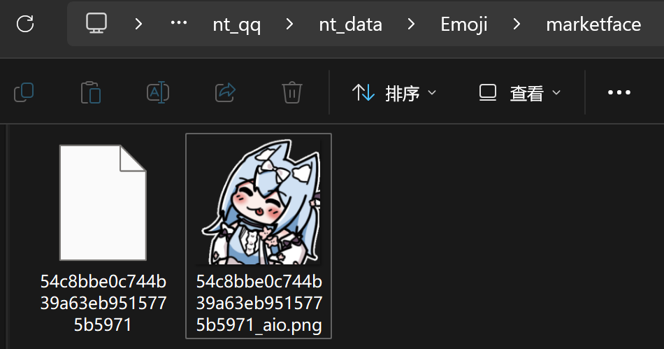
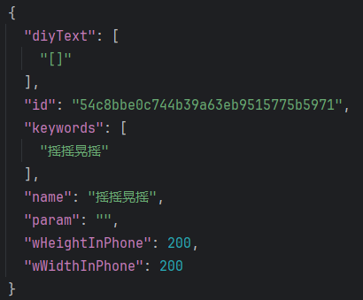
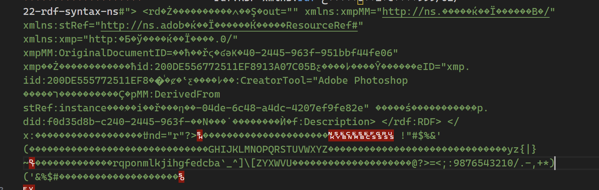
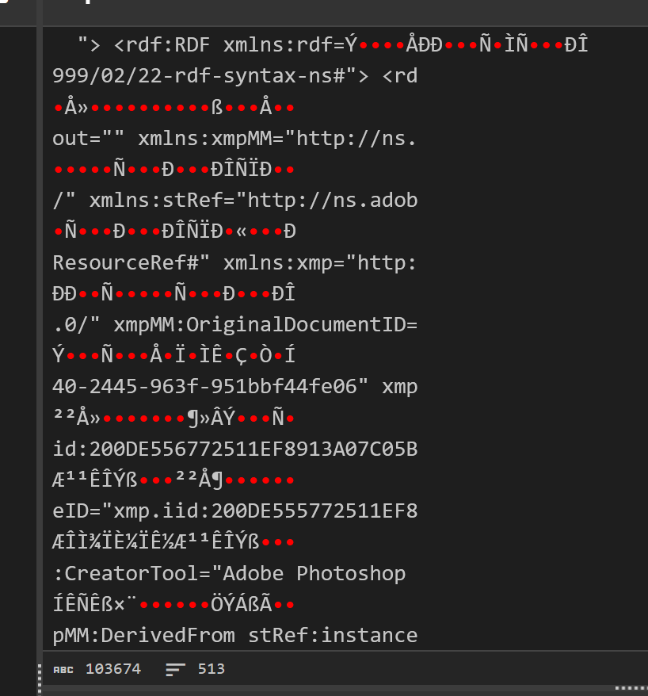
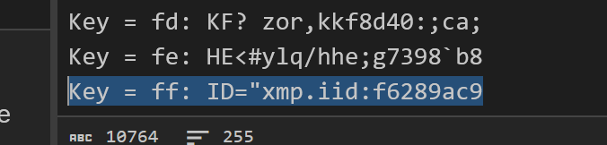

---
date:
  created: 2025-04-09
tags:
  - coding
  - encoding
categories:
  - Coding
comments: true
---

# QQNT 市场表情包的存储与解码

最近在与 QQ 群友聊天的时候，有人偶然发现 QQNT 的数据目录下存有类似表情包的文件，但是无法直接使用。

身为 CTF 小白的我，当然对这个问题比较感兴趣了，于是试试看？<!-- more -->

!!! info "声明"

    此文章的内容仅供技术交流目的，实际操作时，请务必尊重表情包原作者版权。

## 存储位置

按照这位网友的指示，可以在 `<用户目录>\Documents\Tencent Files\<QQID>\nt_qq\nt_data\Emoji\marketface\` 找到存储的表情包。



顾名思义，这里存放的是市场表情包（发布在 QQ 表情平台）。与我们自发上传的 GIF 表情包相比，它们按 ID（目前来看可能是上架 ID）归入不同的子目录，可供下载但无法直接保存。

## 文件属性

子目录下文件名称的命名方式未知，可能是某种哈希校验值；带 `_aio` 后缀的应是在表情选择界面显示的缩略图。以此类推，不带扩展名的文件应该是动态表情本体。参考表情包信息的 JSON 数据，可以证实这一点：



尝试打开这个不带扩展名的本体文件：



有乱码，但是也有可读的文本，二者混在了一起。于是我们猜测乱码区域可能做了一些处理，比如异或（在没有密钥的情况下，这是处理起来最简单的方法，因此也很容易想到）。

问题在于，这些乱码区域是分布开来的；好在经过一段时间的观察，我们发现乱码与可读区域段的长度是固定的：可读区 30 个字符，加密区 20 个字符。



对加密区进行异或爆破，可以发现异或的值是 `0xFF`：



## 解码与恢复

证实我们的猜测后，写一个脚本恢复原有结构就很容易了：

```python
FILENAME = "test"

# Apply de-obfuscation: Keep 30 bytes, XOR next 20 bytes, repeat
chunk_size_keep = 30
chunk_size_xor = 20

with open(FILENAME, "rb") as f:
    binary_data = f.read()

    restored_bytes = bytearray()
    index = 0

    while index < len(binary_data):
        # XOR 20 bytes
        xor_chunk = binary_data[index:index + chunk_size_xor]
        restored_bytes.extend(b ^ 0xFF for b in xor_chunk)
        index += chunk_size_xor

        # Keep 30 bytes
        restored_bytes.extend(binary_data[index:index + chunk_size_keep])
        index += chunk_size_keep

    # Use binary mode for writing
    with open("output", "wb") as opt:
        opt.write(restored_bytes)
        print("Wrote output file to `output`.")

        opt.close()

    f.close()
```

如此就能将经过混淆的市场表情包文件转化成正常的 GIF 文件。
