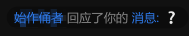

---
date:
  created: 2025-09-24
tags:
  - thoughts
categories:
  - misc
---

# 回应从何而来

!!! warning "友情提示"
    这篇文章起初是为了记载笔者最近常常遇到的另一件可能令他大为光火的事，不过随着时间的推移与情绪控制，开始转向对互联网现象的轻度研究，这一转化被证明是有利的。

    本文接下来的部分可能含有：

    - （可能会有人认为）冒犯或攻击性的内容
    - 并不适合所有人阅读的内容
    - 轻度讽刺
    - 未完成或润色的原始内容

    如果您没做好心理准备，或认为自己不适合阅读这类内容，请现在离开；如果您感觉被冒犯了或生理不适，Clonewith 在此深表遗憾，但也会很高兴 that he has got company。

平时稍微有些了解我的朋友（以及现在读到这篇文章的各位）应该知道，我有即兴写些小文章的兴趣。<!-- more -->

这样的兴趣经历过一段时间的削减（起因见[这篇文章](from-the-redacted.md)），但得以不时在某些地方开展下去。一般是在看到有人发了新梗或者是有意思的小短文，恰巧自己也想做点额外的润色与发挥的时候（主动发起的情况现在也不及之前多了，依然见上面的文章），就在自己的思考上，加上过去的很多教训，有时还得叠上几层厚甲，来写 ~~自己~~ 他们心仪的东西。

写一篇小文章着实是件颇费脑力（算力？）的事情，大概流程见下：

- 分析输入（这里是现有的消息）
- 分析上下文（小团体组成、话题标签、可能的回应）
- 使用插件（替换、扩增、重写，对于梗来说，替换用得比较多）
- 构思内容，完成初稿
- 结合条件进行审查与修改，完成终稿
- 再次检查（强迫症发力），有必要则再次修改
- 发送

于是来活了——有个带头衔的群友发了篇套“最新最热”某梗的小短文。鹿管？冷汗？智斗天花板？哎呦我去这我再熟悉不过了啊，边缘话题这一块属实是给这代网友玩明白了。虽然我也不知道这个梗究竟从何而来，不过一定很有趣，不然这么多`续标识`（笔者注：即按钮动画表情，设计理念未知）怎么来的？

那我更进一步，大概没什么问题吧？哎呀，这个时候就得礼貌点问一句，别非礼人家了：

> 再写点##的）
>
> [有人回复我] 我也是转发（

他回复得很快啊，哎呀哎呀，兄弟您真是品位高雅啊，这么优质的内容都给您搬来这群了。那我不写一点给其他群友开开眼就可惜嘞。所谓行走在未知地带，才会有绝佳的快感，看你也在闲着没事干，不如就此写一笔释放下开学至今心底的积怨吧。完形填空，来——

> 说实话##真是智斗天花板了，里面操作逻辑缜密，???全员在线，尤其是???的那一刻我浑身上下冷汗直流，???的压迫感太强了，它冲过来的时候差点给我???。

这个时候不禁想到很久之前本人的文笔还是相当豪放的，写啥都很能放得开，加了这么多安全措施纯粹是为了小团体里的其他人考虑...毕竟谁不想做个无时不刻举手投足照顾他人感受的乖宝宝？*被生活磨平了棱角*也。Did I ask for this? 非也，所谓团结友爱理解，稍有不慎即会被贴签孤立以至于被针对也。互联网，很有趣吧。

欸你别说替换法就是好用，一分钟过去，这带派小文章就熟了，搁那文本框里等着飞起来呢。于是，就这样，发了？不不不，再检查一遍，这个词如此直接提出来的话，他们又要有人跳出来异议了，再改，再查。发吧？不行，格式还得整理一下，分个段，梗模板和创作还是有点区别的。好好好，我改。没问题了？发。

## 这是深水区吗 求雷...科普

过去互联网尚未成型的时候，那些诗性大发的文艺青年们，他们作诗前后什么时候最兴奋？当然是把自己写的东西对着亲朋好友念，他们听到了都绝口称赞“好诗！好诗！”“你这水平能给##投个稿了”的时候了。他人对个人工作的积极回应（短期内甚至不会去要求一定是由衷的）正是劳动者的辅助动力。而到互联网这里，反馈来得越发即时多样，直接推动了创作者对积极反馈的渴求，积极反馈迟迟不来的焦急（焦虑），以及当：

我的中央处理器回应了：❔

**你干嘛**

是的，经常被泼冷水的朋友应该知道，这种感觉有如正上头的时候被从头上泼一盆冰水，期待与兴奋的通路瞬间被截断了，取而代之的是满脑子的问号与无名怒火。“**败兴**”是比较能恰当形容这种情况的。事实上，我们的父母也常常在大型场合（如宴会活动）用这个词来指责突然哭泣或发怒（即“闹腾”）的孩子，对，我有幸经历过。

这时我是真想@上那个群成员问“你怎么回事/你什么意思”，但是——哎呀哎呀，你看这...好好说话！不能伤了大家的一片和气。他们聚在一块都不容易啊...行，于是我从了，毕竟个人不代表群体。

> 🎵识人术🎵🎵🎵社交的手腕🎵🎵🎵暗黑心理学🎵🎵🎵人性的秘密🎵🎵🎵识人术🎵🎵🎵

其实被回应一个问号也不算啥大事，我讨厌的是被区别对待，以及太多无意义的回复。然而，问号增多了。

既往的经验告诉我，这 99.19810% 是不妙的征兆，预示着会有群成员通过异议发难现身说法，或者是管理员通过撤回消息现身说法。于是，我很快撤回了消息，而常常被发难自己撤回消息的各位也知道，消息是撤回了，但是覆水难收，后期处理与熄灭心头之火依然没那么容易。这个时候也是最容易被其他人发言牵着走的危险期，因此与其如此不如先发制人，同时试图挽回局面：

> ok 看来也够了 有条件的自己到记录看

从语法角度上，所有单个标点符号都应被视作无意义内容，只是互联网带来的交流习惯放宽了这一限制，让它们中的一部分在有充足语境的情况下也有了些意义（举个例子，常被称为二次元使用的不成对圆括号）。即便如此，问号作为表示疑问的标点符号，在缺少明确提出问题的情况下仍然是不足以表意的。

如此愤怒的另外一点原因是，我与前面的群友原是有相同的元素，为何他的短文（甚至还是转发不是原创）就受到了青睐，我的就被打各种问号——这何尝不是一种歧视？

!!! info "信息"
    这一观点很主观，但力求于复现笔者角度的感受，敬请谅解。

后来与他们中交往比较亲密的一位（管理员）简单交流了一下，他本来也是稍微想去撤回的，经我这么一说就去撤掉了。不过为什么回应一个问号的问题，想了想还是没去问下去。考虑到他的想法，这应该是从众心理与破窗效应在作祟，不过我这方面也是知之甚少（同时也是因为还需要进一步分析与思考），暂时就写这么多。

这篇文章基本都在讲故事，真正做理论分析的内容没多少，然而现在已经是深夜一点半了而明天还有早八，真得控制下自己的作息了，于是先写到这。

## 另一篇没那么带派的小短文

这篇小短文是笔者在试图平息愤怒，控制住理智时写就的另一篇短文，也希望能警醒有创作兴趣或是意向的各位。

说实话发个小作文真是智斗天花板了，里面操作逻辑缜密，受众分析、关键词过滤、其他插件全员智商在线，尤其是消息编好正要发的那一刻我浑身上下冷汗直流，方块字填满文本框的压迫感太强了，反复检查的时候差点给我吓哭了。

我始终都不明白我是怎么把那条消息发出来又撤回去的。那堆起来的问号emoji直击了我的灵魂仿佛把我内心的想法全看了出来，等尽数撤回后我才缓了过来，当时吓得我一身冷汗，后劲大的一时半会没缓过神来，真是难以想象我能作出这样的动作...

（补全了标点，不然我会难受）
