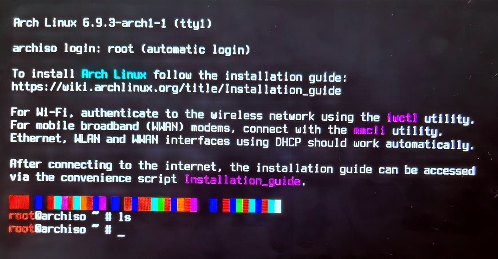

---
date:
  created: 2024-06-17
tags:
  - linux
  - system
  - tools
categories:
  - Tools
comments: true
---

# 安装 Arch 之事前准备

在这篇文章中，我们主要讲述安装 Arch 之前，一些基本的准备事项与检查事项，其中大多可能都是老生常谈的内容。<!-- more -->

## 基本知识及链接

与多数现代操作系统相同，Arch Linux 支持使用镜像文件（如 `.iso`）进行安装；安装过程可在实机进行，也可以使用配置中档的虚拟机。与 Windows 的组件 WSL 相比，单独安装的 Arch Linux 更加纯净、原生，与软硬件有更好的兼容性，也让你能有更多的空间自由发挥。

进入正题，安装 Arch 最常见的方法即使用 `.iso` 镜像，这也是这篇文章中我们会使用的方法。这需要你有空间至少为 2GB，且能够直接连接到安装目标设备的硬盘/U 盘。

同时，建议你在安装过程中准备好这些，以备不时之需：

- 浏览 [Archlinux Wiki](https://wiki.archlinuxcn.org/)：官方的社区文档
- 一些你觉得有用的社交平台，如 Stack overflow，方便查看他人的提问
- 摄像头或相机，在不便直接截图时记录下一些有用的信息，以备日后使用
- 备份好重要数据，防止误操作导致数据丢失。有经验者可忽略（

## 设备配置检查

Arch 对设备配置的要求并不高，但设备的配置会影响到安装过程的方方面面。因此，提前了解好设备的各项参数是极其重要的。

下面将作者的设备配置贴出来，供大家参考：

- 实体机：Huawei MateBook X
  - 32GB RAM，忘了什么 CPU
  - 1 TB 内置存储 (NVME)
  - 2 Bolt 接口（也许是）+ 1 Type C 接口，这种情况建议准备扩展坞
  - UEFI，安全启动支持
  - 触摸屏 + 触控板
  - 仅无线连接网卡
  - 已有 Windows 11 系统
- 扩展坞一个（建议带 >= 2 个 USB 接口，方便外接鼠标与硬盘）
- 存储器一个（我用的是旧硬盘+硬盘盒）

此系列文章的其他部分都以上面的配置为基准写成的，请大家以实际情况为准。

此外，请**提前检查**你的 EFI 分区大小！在后续步骤中，编译好的内核加上已有内容可能至少会占用 > 600MB 空间，建议分区大小不小于 1 GB。

你也要关闭全盘加密（如果有）！

!!! info "如果大小不足该怎么办"
    这在系列的后续部分会讲述。

    坐等一个链接...

## 特典：时钟同步设置

在 Arch 中，系统默认会将**硬件**时钟时间设置为*协调世界时 (UTC)*，而 Windows 默认将其设置为*本地时间*，因此当从 Arch 重启到 Windows 系统时，会导致一个 8 小时的系统级时差。

这一点在[Archlinux Wiki 的双系统指南](https://wiki.archlinuxcn.org/wiki/%E7%B3%BB%E7%BB%9F%E6%97%B6%E9%97%B4#Windows_%E7%B3%BB%E7%BB%9F%E4%BD%BF%E7%94%A8_UTC)中有所提及，可以使用注册表提前修正。

这里需要使用**管理员权限的命令提示符 (cmd)**，输入如下命令：

```sh
reg add "HKEY_LOCAL_MACHINE\System\CurrentControlSet\Control\TimeZoneInformation" /v RealTimeIsUniversal /d 1 /t REG_DWORD /f
```

## 下载与转化镜像

在 [Archlinux 官方下载页面](https://archlinux.org/download)获取镜像文件，你可以向下滚动，在 `China` 小节对应的部分任选一个链接，从而在镜像站点下载文件，会稍微快一些。镜像大小约为 1 GB 左右。

你可以酌情使用页面上的方法验证完整性（一般不会出问题）。

接下来将镜像中的内容转入存储设备。这里推荐大家使用 [Ventoy](https://www.ventoy.net)，只需将镜像文件移入设备即可用它引导。

## UEFI 设置

使用设备对应的方式进入 UEFI 固件设置页面。对 MateBook X 来说，重启后出现 Logo 时需要按住 `F2` 键，之后会进入设置界面。

!!! info "无法直接进入固件的设备"
    Arch Linux 的镜像里有一个菜单项，可以用于进入设置界面，具体操作见下。

在设置界面中进行如下操作（如果有）：

- `安全设置`中，禁用`安全启动`，避免后续安装引导过程中的问题。安装就绪后，你可以参照 Wiki 中的指示将其重新打开。
- `高级设置`中，关闭`操作系统智能还原`，以防引导修改触发还原（这里我提前就把它关掉了）。
- 启用`支持从 USB 设备启动`，并调整启动顺序，将你的外接设备放在上面。
- 保存所有配置。

## LiveCD，启动

如果安全启动未能关闭，从 Ventoy 设备引导时，可能出现蓝屏报错，按回车后会进入 MOK 管理页面。以下界面都是蓝底白字，经过抽象化处理：

```md
# Perform MOK management

- Continue boot
- **Enroll key from disk** <-
- Enroll hash from disk
```

选择从硬盘注册密钥，进入相应的文件系统与目录（这里是 `VTOYEFI`）：

```md
# Select Key

The selected key will be enrolled into the MOK database
This means any binaries signed with it will be run without prompting
Remember to make sure it is a genuine key before enrolling it

- SYSTEM
- WINPE
- **VTOYEFI** <-
```

进入浏览文件，选中那个要求注册的 `.cer` 文件：

```md
...

- grub/
- ventoy/
- EFI/
- **ENROLL_THIS_KEY_IN_MOKMANAGER.cer** <-
- *以下内容省略*

...
```

在此之后，会进入正常引导界面，画面重转为黑底白字，直接选择默认选项。稍等片刻，LiveCD 会将你带到默认的 Arch Linux TTY。



**启动成功，感觉良好。**
