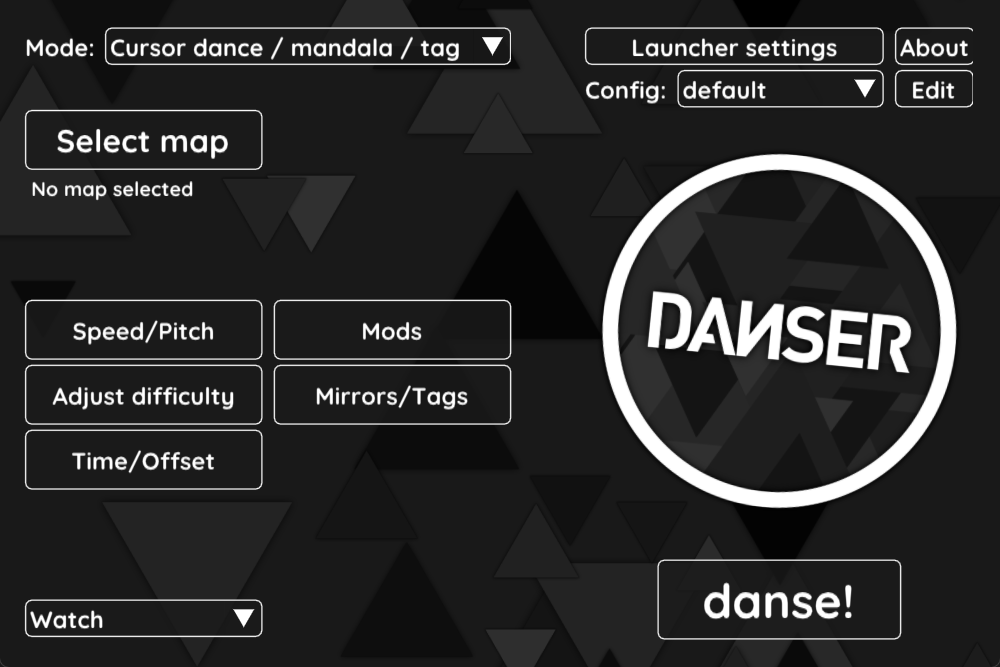
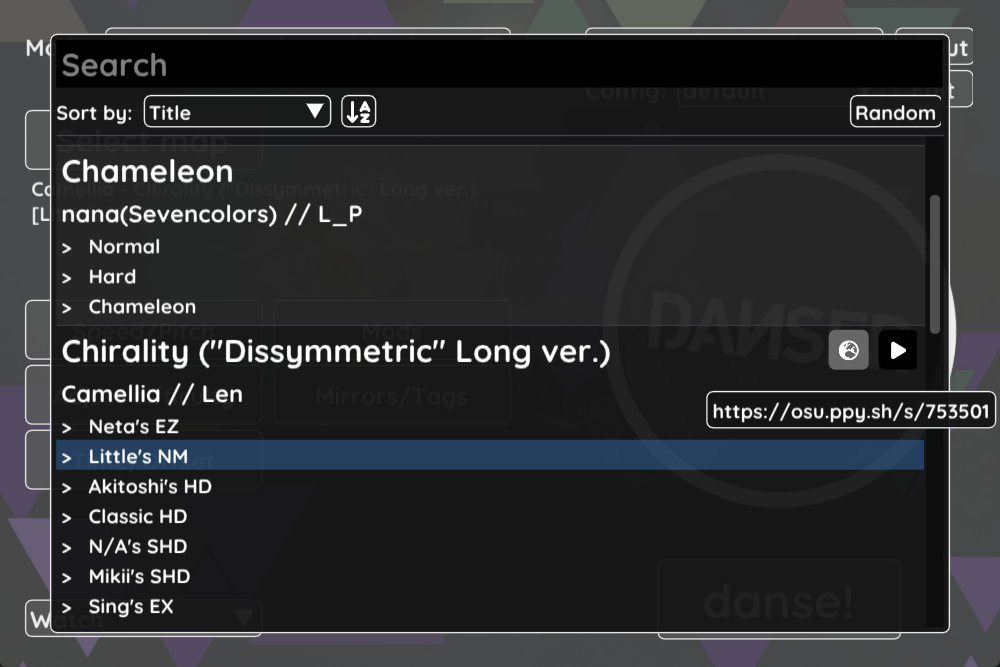
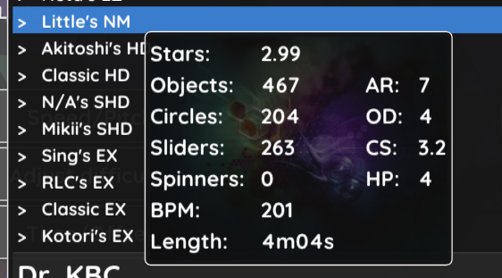
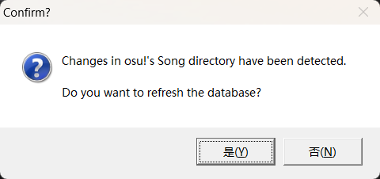
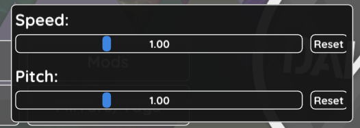
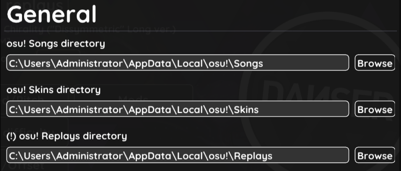
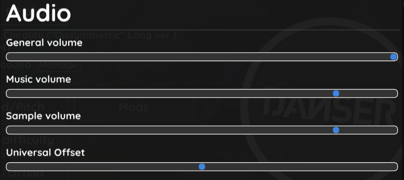

---
tags:
  - osu!danser
  - guide
comments: true
---

# osu!danser 入门指南 - 1

osu!danser 是一款由 @Wieku 开发的 osu!standard 可视化程序。截至发布日期，它已经支持 Windows 和 Linux 操作系统，并且支持图形界面的操作。目前 osu!danser 仅有英文版本。

出于软件的默认配置，此软件开箱即用。当然，如果能够基于个人喜好对其进行一些细微调整，就会看到令人惊艳的效果。

## 获取

在 Github 上可以下载 osu!danser 的最新版本。具体链接：[danser-go](https://github.com/Wieku/danser-go/releases)。网页最上面的位置是最新版本（标有绿色标签 `Latest`），可以根据个人的操作系统下载对应版本。

网站下载的是 zip 格式的压缩文件，需要将其解压到单独的文件夹中才能正常使用。

## 使用

截至发布日期，最新版本提供了两种使用 osu!danser 的方式：图形界面(danser.exe)和命令行(danser-cli.exe)。

出于易用性考虑，本文主要介绍使用图形界面的方法，命令行配置可以参照[此文章](https://www.bilibili.com/read/cv12700695)。

直接双击运行 danser.exe 即可。启动时会弹出一个主窗口和一个命令行窗口（主要用于显示日志），关闭任一窗口均可退出程序。

### 模式选择

osu!danser 提供了下列几种模式：

- `Cursor dance / mandala / tag`: 自动游玩所选谱面。
- `Cursor dance with UI`: 同上。这两者的区别如下：
  - `Cursor dance / mandala / tag` 只会显示主界面，不显示其他任何元素（如排行榜，连击计数，血条等等），而 `Cursor dance with UI` 则会显示。
  - `Cursor dance / mandala / tag` 支持设置镜像(mirror)和合作(tag)的光标数目。
- `Watch a replay`: 播放保存的回放，需要预先在 osu! 中保存。
- `Watch a knockout`: 显示一次游玩中多个玩家（包括 Auto）的光标轨迹、按键、准确度及等级。
- `Play osu!standard`: 玩玩 osu! 标准模式，当然不会计入排名。

各种模式的细节都可以在设置中调整，会在下文具体介绍。

### 谱面选择

使用 Cursor dance 和 Play osu!standard 模式时可以直接选择谱面。如果安装了 osu!， osu!danser 会在 `C:\Users\<当前用户名>\AppData\Local\osu!\Songs` 搜索谱面。

点击按钮后会弹出一个简易谱面选择页面。可以在列表中选择谱面，也可以打字搜索。可以按标题、艺术家、制图者、导入日期、难度升序或降序排序（使用 `Sort by:` 右侧的按钮），目前还不支持按条件筛选。点击 `Random` 随机选择谱面。

每组图的标题右侧有两个按钮，分别用来在浏览器中显示谱面详细信息、播放预览。鼠标悬停在难度名上会显示各难度的背景图片和详细信息。

!!! info "数据库更新提示"

    如果`Songs` 文件夹有改动，会提示你更新数据库，直接更新即可。
    

### 一般设置

可以通过主界面的按钮调节各种设置。各种分类如下：

- 各种模式均可使用：
  - `Speed/Pitch`：调节播放速度和音调，默认是 1.00x。
  
  - `Time/Offset`：调节播放的起止时间，以及音频延迟，也可以选择跳过谱面开头。
  
- `Mods` 与 `Adjust difficulty`：
  - `Mods`：选择模组，与 osu! 中操作相同。
  - `Adjust difficulty`：调节谱面的 AR 和 CS 值。

- `Mirrors/Tags`：是 osu!danser 的特色功能。`Mirrored cursors` 设置镜像显示的光标数，`Tag cursors` 设置共同完成谱面的光标数。

下面是对比图。

### 操作选择

主界面底部有操作选项的设置：

- `Watch`：直接观看。
- `Record`：制作视频。
- `Screenshot`：获取截图，可以在`Configure`中设置截图时间(`Screenshot at`)。

对于录制和截图，可以设置输出文件名。(`Output name`)

## 配置

可以通过配置来改变 osu!danser 的行为，使其个性化。

### 启动器配置

比较重要的选项：

- `Show exported videos/images in explorer`：默认是开启的。当选择录制或截图时，操作完成后会在资源管理器中显示导出的文件。
- `Preview selected maps`：默认是开启的。选中谱面后播放预览音频。

### 详细设置 - 基本

osu!danser 使用 json 文件来保存不同配置，可以在软件目录中找到。如果想创建新配置，可以打开 `Config:` 下拉菜单，选择 `Create new...`，以便切换。右击配置名可以进行复制、重命名、删除操作。单击 `Edit` 进入详细设置页面。

!!! warning "注意"

    建议不要轻易改动 `EXPERIMENTAL` 下的选项。带有 `(!)` 的选项，鼠标移到文字上方会显示提示。

#### 文件路径 (General)

如果遇到没有谱面或皮肤的问题，大多是由于路径设置不当。可以找到图示中的三个路径选项，如果不对，可以点击 `Browse` 进行修改，也可以直接输入。

#### 环境设置

osu!danser 提供了与 osu! 相似的设置项，可以对照 osu! 中的设置在其中更改。

默认情况下 osu!danser 不会使用皮肤中的光标和谱面中的 Combo 颜色，需要手动勾选 `Use skin cursor` 和 `Use beatmap colors`。除此之外，默认配置应该已经满足日常使用的基本需求。在下一篇文章中将会专门解释 Cursordance、 Knockout 等等其他细枝末节的设置。
