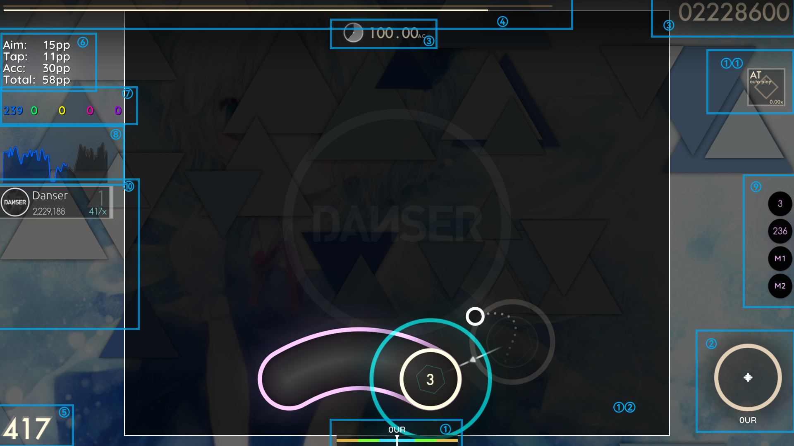

---
tags:
  - osu!danser
  - guide
  - WIP
wip: true
comments: true
---

# osu!danser 入门指南 - 2

此文章将详细讲解 osu!danser 中的一些配置细节，重点在游玩界面的自定义上。

## osu!danser 中的坐标系 {#Coordinate}

!!! info "阅读提示"

    这里讲述的内容涉及一些数学知识，已经了解的读者可以跳过。

大多数元素位置上的确定与对齐方式都与程序内定的一个坐标系有关。由于其普遍性与统一性，作者就先花一些时间，在这里先行解释。

在 osu!danser 中，以窗口左上角为原点建立坐标系，水平向右对应 X 轴正方向，竖直向下对应 Y 轴正方向。坐标系的数值以 osu! pixel 为单位（这一点有待证实）。

由此，不难按照上述原则，设置下面一些参数：

| 参数 | 解释 |
| :-- | :-- |
| `Position` | 在坐标系上的*绝对*位置 |
| `Offset` | 多用于 osu! 中原有元素，指示以元素几何中心为原点，建立坐标系上的*相对*位置 |
| `Align` | 默认使用元素的 9 个点（顶部/中间/底部，左侧/中间/右侧），标明此点的坐标用于元素位置的确定 |

## 游玩界面元素 (`Gameplay`) {#Gameplay}

!!! warning "注意"

    下文所述的界面元素自定义设置，只有在 `Cursor dance with UI` 以及 `Watch a replay` 模式下才有效。

为了玩家方便，osu!danser 在 osu! 原有界面元素的基础上，添加了一些新元素，同时对上述所有元素尽可能地添加了个性化设置，以便自定义 UI 的需要。



### 偏差计 {#ErrorMeter}

#### 打击偏差计 (`Hit error meter`) {#HitError}

`Scale with speed` 色块长度与速度系数成反比例缩放。

```go
errorPos := error * 0.8
if settings.Gameplay.HitErrorMeter.ScaleWithSpeed {
  errorPos /= meter.diff.Speed
}
```

`Static unstable rate` 使显示的不稳定率数值更稳定

#### 瞄准偏差计 (`Aim error meter`) {#AimError}

### 计数器 {#Counter}

#### PP 显示 (`PP counter`) {PPCounter}

#### 打击结果统计 (`Hit counter`) {#HitCounter}

### 难度图谱 (`Strain graph`) {#StrainGraph}

### 游玩区域边界 (`Boundaries`) {#Boundaries}

## 剩下的东西

系列文章的内容之前有在 B 站专栏上发表过一部分，有兴趣的读者可以移步前往，传送门：

1. [获取与基本使用](https://www.bilibili.com/read/cv23096754)
2. [基本配置](https://www.bilibili.com/read/cv23105271)
3. [进阶配置 - 元素](https://www.bilibili.com/read/cv23185996/)

## Cookies

- 外观设置（背景、物件、光标？单图指示？）
- Cursordance 设置(分类？加号是什么意思？)
- 指示器设置（有哪些元素？单图指示？）
- 目前可以设置的元素有：`Hit error meter`、`Aim error meter``score``hp bar`
`combo counter``pp counter``hit counter``strain graph``key overlay``score board``mods``boundaries``underlay`
