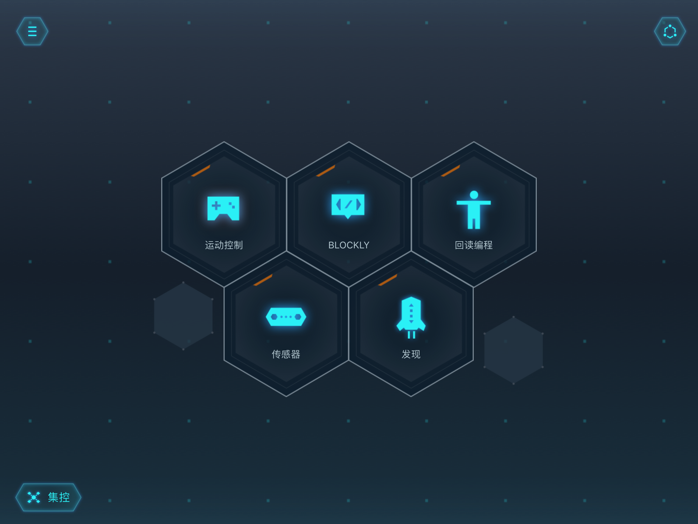
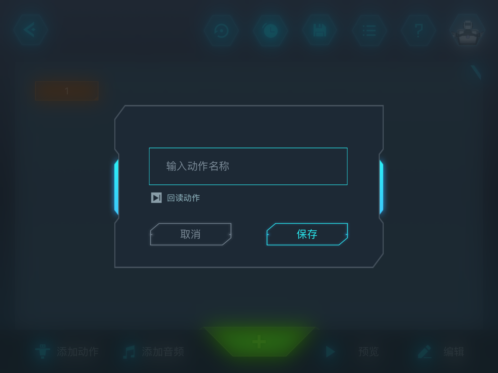
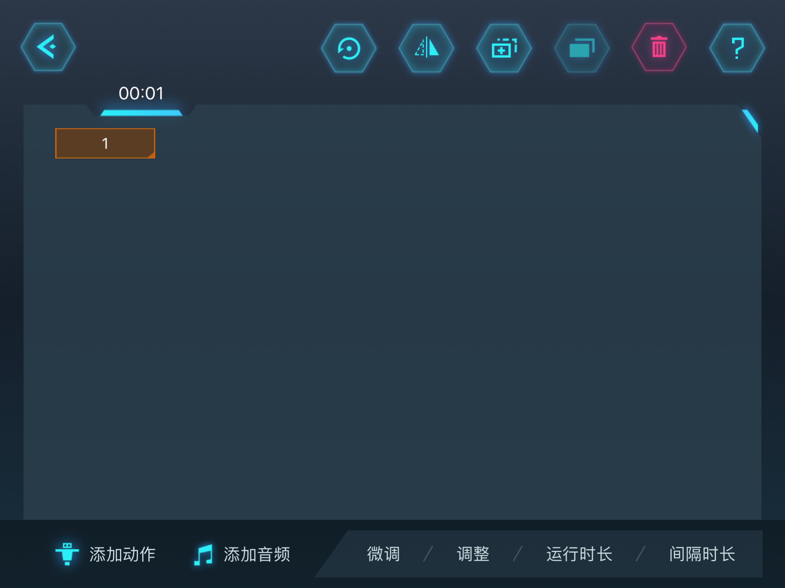
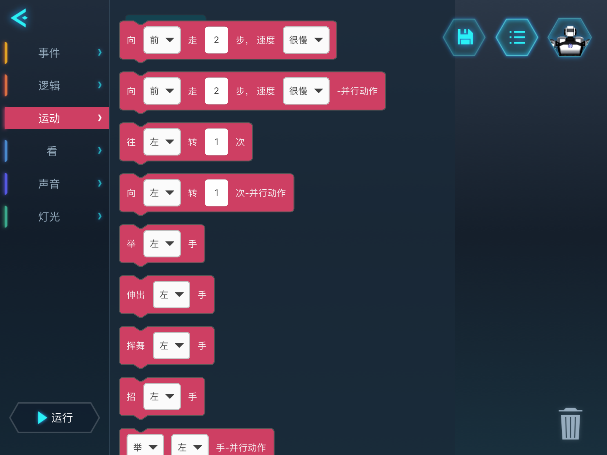
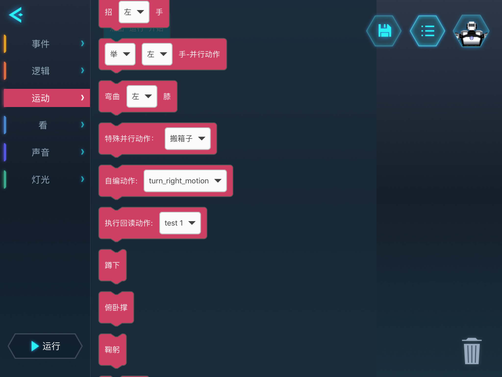

---
tags:
  - Yanshee
  - AI
  - Robotics
  - Competition
  - Motions
comments: true
---

# 关于我和 Yanshee 的那些事 - 动作编译篇

执行赛事程序时，需要控制机器人执行大量动作。系统内部只自带了一小部分动作，剩下的绝大部分需要自己建立。

## 编译工具 {#Editor}

Yanshee 开发的公司提供了一些~~强有力~~的工具来进行动作方面的设置。具体见下：

### Yanshee Studio

!!! info "提示"

    截至 2023 年 6 月 1 日，Yanshee Studio 的官方下载链接已被删除。可能会考虑提供网盘直链。


`Yanshee Studio` 是一款专用于机器人动作编写、适用于 Windows 平台的 Qt 应用程序，也是我最喜欢使用的动作编辑器。

此应用内部已自带帮助文件，可以点击查看。

### Yanshee APP



Yanshee APP 自带回读编程功能，但**只支持新编动作以及修改同一台设备编辑的动作**。也就是说，如果你的动作是通过其他方式导入的，那么你无法用这种方法进行编辑。APP 自带手册里已经讲得很详细了，我再来补一下一些没有提到的点：

其一：回读动作如果选择`连续记录`，间隔时间是可以修改的，点击正常模式下的左数第二个按钮可调整。

#### 保存界面 {#Save}



只需要输入动作名称，也是之后导入到机器人动作文件夹中的 `.hts` 文件名。（按原样输入的文件名，空格与 CJK 文本会照常转化）

#### 编辑界面 {#Edit}



这里有一些特别有用的功能，想要细致调节动作的话则不能忽略。

- 动作显示区：即中央的大方框。长按并拖动可以选择多个动作，但*只支持连续选择*。
- 下方文本按钮：
  - 微调：可**按舵机**调节角度。
  - 调整：点击要调整的肢体，待掉电后进行粗略调整。
  - 运行时长：每个动作运行的时间。
  - 间隔时长：每个步骤间的等待时间。
- 上方按钮：（恢复，镜像，复制，粘贴，删除，帮助）
  - 镜像（左二）：将手臂与腿部舵机角度左右交换，**不会调整动作执行顺序**。
  - 复制/粘贴：字面含义。

#### 发送界面 {#Share}


编辑好的动作默认保存在本设备上，需要进入动作列表、点击`发送`按钮（向外的箭头） -> 发送到 Yanshee 后才会导入机器人的文件夹。

## 使用方法 {#Usage}

编译完想要的动作后，如果需要在脚本或程序中使用，可以有如下方式：

### Blockly 积木编程 {#Blockly}

!!! info "提示"

    据了解，现在 UCode 也支持积木编程了，感兴趣的朋友可以去体验一下。

在积木编程的`动作`栏里，可以添加执行自带动作与自定义动作的积木，**支持使用已导入机器人的动作，即`自编动作`，以及`执行回读动作`**。





### YanAPI

使用 YanAPI 可以实现对已有动作的快速调用。主要可用的 Python 函数：

- `YanAPI.start_play_motion(name: str = ‘reset’, direction: str = ‘’, speed: str = ‘normal’, repeat: int = 1)`
- `YanAPI.sync_play_motion(name: str = ‘reset’, direction: str = ‘’, speed: str = ‘normal’, repeat: int = 1)`

具体使用上，我比较喜欢写一个函数再封装，这样更加可控。

```python hl=6,7
import time
import YanAPI

def robot_motion(motion="", num=1, wait=True, speed="normal", dir: str = ""):
    print("[i] 执行{0}动作{1}次，方向{4}，速度{3}，{2}".format(motion, num, WAIT[wait], speed, dir))
    res = YanAPI.start_play_motion(
        name=motion, direction=dir, repeat=num, speed=speed)
    if wait == True:
        waitdone()
    else:
        pass
    return res

# 等待动作完成
def waitdone():
    time.sleep(0.2)
    while True:
        res = YanAPI.get_current_motion_play_state()
        if res["data"]["status"] == "idle":
            break
```

## 注意 {#Note}

以下注意点中，大多数来自**本人亲身经历**，如果你没有遇到，可算是幸运了。

### 使用系统自带的动作 {#Builtin}

你通常要先查阅在线手册，知道动作名称、对应的可用方向。笔者将可用的自带动作引用表格如下（官网表格）：

| 动作名 | 可用方向 |
| :-: | :-: |
| crouch/bow | 无 |
| raise/stretch/come on/wave | left/right/both |
| bend/turn around | left/right |
| walk | forward/backward/left/right |
| head | forward/left/right |

### 动作尺度 {#Range}

出于 Yanshee 机器人的设计~~问题~~，舵机的转动角度范围是严格受限的。因此，稍不留神就会让舵机掉电，什么意思呢：如果你发现...

- 机器人的一个部分突然能够自由移动（而不是正常情况下紧的）
- 机器人的一部分舵机无法实现动作中的角度变换
- 机器人的一部分舵机有焦糊味（玩大了）

那就说明机器人的舵机已经掉电。通常可以这样处理：

- 先扶好机器人！（特别是腿部关节掉电的情况下）
- 若使用的是 Yanshee Studio：点击`复位机器人`，机器人会自动恢复所有电机的状态（烧焦的除外）并回到原位。
- 如果不是上述情况，或点击后没有效果：尝试重启机器人。
- 按需将机器人送修（）

因此建议，事先确定好机器人四肢大致的运动范围，尽量避免直接调节舵机参数（尽量使用回读方式编程）。

### 动作文件 {#Motion-File}

经查，Yanshee Studio 的动作保存与导入过程中小概率会出现问题。在导入的过程中，如下两种情况；

- 你的工作目录已有同名的 `.xml` 或 `.hts` 文件
- 机器人的动作目录已有同名的 `.hts` 文件

当导入动作时，尽管会提示成功，但重新打开导入好的动作后，动作区一片空白，无法执行动作。可使用如下方案避免：

- 保存动作时优先使用`另存为`另外一个名字的文件，避免直接覆盖
- 在向机器人导入动作前，先检查是否已有同名动作，如有先重命名（不建议删除，万一新导入的动作无法使用需要回退）

### 个人问题 {#Others}

...

!!! warning "警告"

    握住机器人身体的时候心里要有数，手不要放在肩部、腿部、头部！**本人因上述行为被夹 3 次！**
