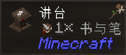
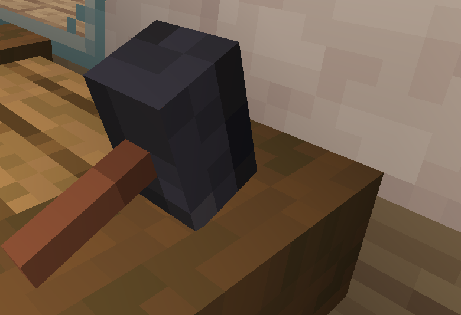

# 这是什么？MC整合包！

从蛇年的 1 月 28 号开始，CloneWith 就进入了一种微妙的状态，我们称之为“煎包态”。因为每天的不固定时间，他都会打开电脑玩一款开放世界的 3D 游戏，并不停地向同样也在玩游戏的玩家索求水煎包（这是游戏中的一种货币，可以用来实现交易、升级等等诸多用途），这样他就可以补足因为过度打游戏缺失的营养。

然而在 30 天后的水煎包补充营养后，CloneWith 并没有觉得情况好太多；相反地，他的脑海中开始浮现出很多毫无逻辑的语句与图像。为了寻求帮助，CloneWith 想方设法记下了一些文本，同时具象化了一部分图像，希望有某个小团体的热心网友能答疑解惑，揭开这一切背后的秘密。

以下是能公开的文本：

- `protected static Object? Anime { get; internal set; }`
- `本群内...？`

以下是具象化的图像，和能想到的词汇：

| 图像 | 词汇 |
| :-: | :-: |
|  | ...🖊️ |
|  | 🔨 |
|  | 什么？？！ |

如果能解决这个的话，我会很感激的。
