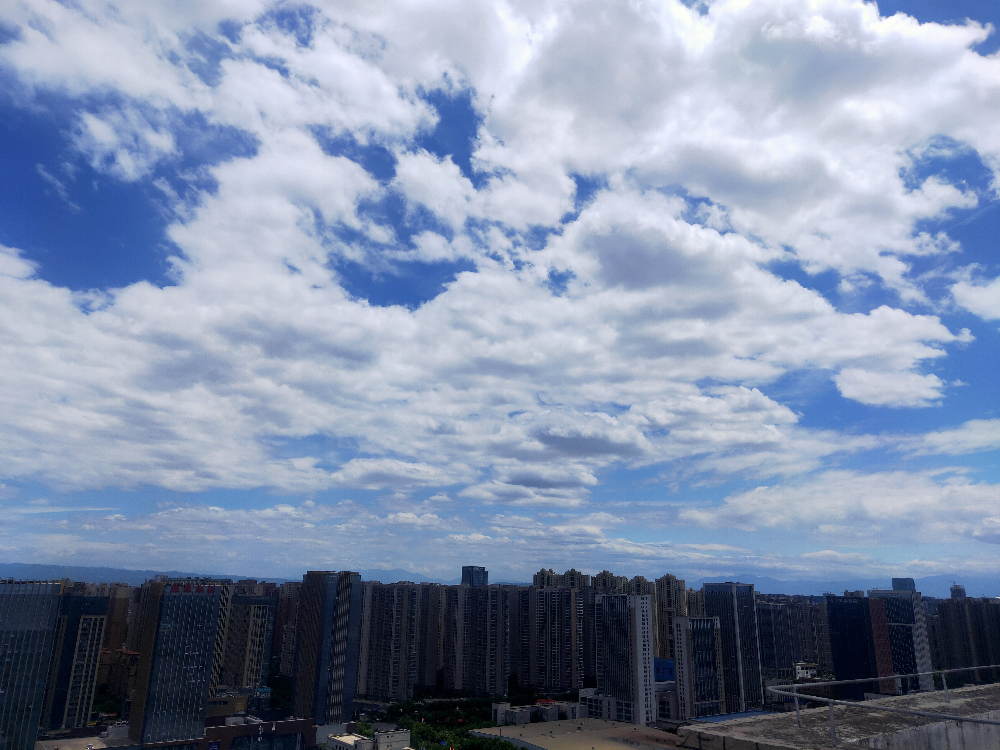
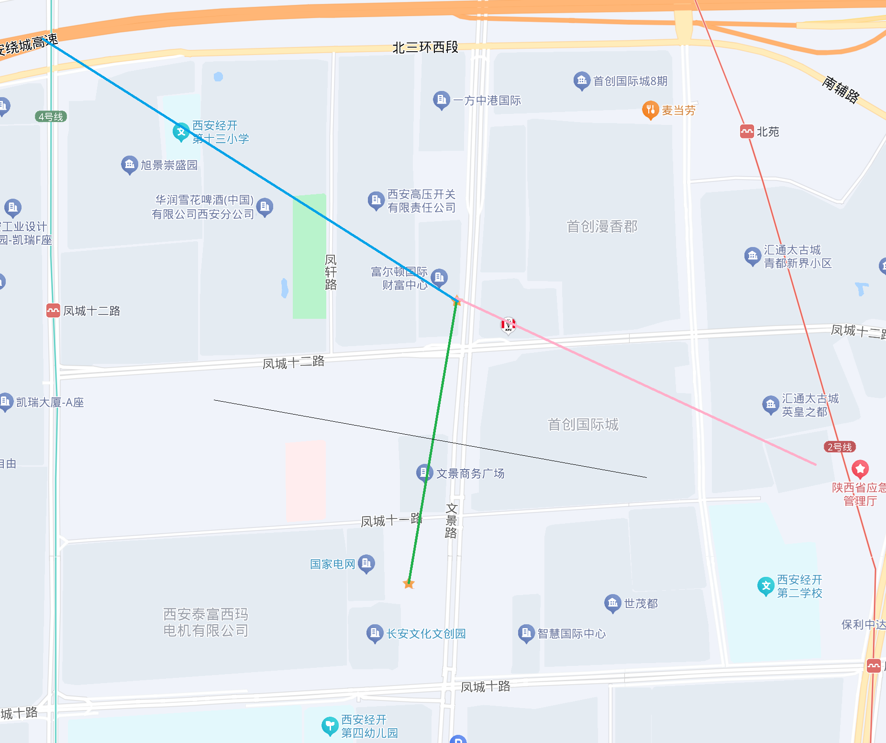
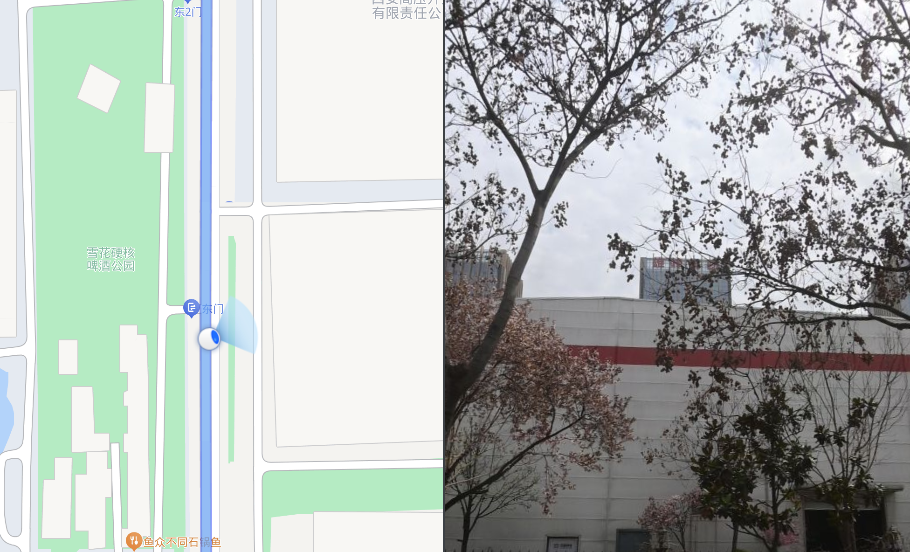

---
tags:
  - cyber-security
  - CTF
  - MoeCTF
  - osint
  - information gathering
comments: true
---

# MoeCTF 2024 信息收集部分

这里的*信息收集*其实指的是 **开源网络情报** (*Open Source INTelligence*)，也就是从网络上搜索题目给出的信息，从而获得与 flag 相关的情报。

事实上，这里的网络情报不一定*开源*，但是一定是*公开*...

## Find It

“今天天气真好啊，不愧是我大西安”，来西安旅游的 npm 感叹道，拍张照片吧。可惜，npm 并没有想到，这张照片暴露的信息貌似太多了，你能根据这张照片找到 npm 拍摄照片时所在的小区嘛。

注：

- 该小区有两个幼儿园，请取两个幼儿园共有的字，全拼小写，以 `_` 分离且以 `moectf{}` 包裹提交
- 此题不建议用谷歌地图

---

这里将附件附上，可能会有压缩，建议各位到西电平台官网对应题目直接下载附件。

对于照片这类的敏感数据，可以优先考虑其元数据信息，但是发现并没有什么有用的情报。结合题目提示，可以考虑使用地图找点（例如百度地图）。

从这张照片中，可以先寻找一些特别明显的地标（例如标志性的建筑物，或者有特殊字、图案的东西等等），这些都是最容易在图上搜索的。

应该不难发现，照片偏左下部分的大楼顶有红字“雄峰集团”，结合地区提示，搜索`西安 雄峰集团`可以找到第一个位置点：**陕西雄峰实业集团有限公司**。

要确定拍摄者所在的（平面）位置，至少还需要一个位置点。

从建筑群向右查找，应该能看到似乎位于同一排的“桔子水晶酒店”，然后在上述点所在图区周边搜索，找到第二个位置点：**桔子水晶酒店(西安北站市政府店)**。

两个点能够确定一条参考直线，但为了更准确的定位，还需要判断拍摄者在直线左侧（西）还是右侧（东），同时也要留意**图像有无翻转**。在这道题中，因为大楼的字是正的，所以未经翻转，使用全景地图到附近的道路寻找这个大厦就行。

由上图，可以判断出大厦的有字面朝向西。

同时根据照片上目测拍摄者到雄峰大厦的距离比到桔子水晶酒店大楼比较近，进一步得出拍摄者在两个建筑物中点的**西偏北**方向。

结合距离与`两个幼儿园`关键词，不难找到拍摄者的小区是**旭景崇盛园**，内部有两个幼儿园：

- 吉的堡旭景崇盛幼儿园
- 吉的堡英佳幼儿园

那么同字是`吉的堡幼儿园`，对吧？最后一个点是`的`的多音字读法，这里作者通过尝试才得出来是读 `di`...

## 时光穿梭机

大量的铯废料堆积，能量放射过高，划出时间裂缝，sparkle 穿越到 1946 年 4 月 20 日的伦敦，一脸茫然的她捡到一张当地知名的画报，上面写着国内的消息，知名古墓被开！？正当疑惑时，一眨眼又穿梭到 2024 年 8 月 23 日的该古墓遗址公园，反复的时空穿梭令她心口绞痛，从公园正门夺门而出，来到正对的中医院，大夫热心地治好了心痛之疾，眨眼间又穿梭到家，打开电脑，记录下这段神奇的经历！

wait a minute! 还没有付给大夫医疗费用，可记忆只剩下了这些，你能帮帮她吗？

//以上故事内容纯属虚构，请按照提示作答。

flag 内容为中医院前三个汉字的小写拼音，整个汉字拼音之间以 `_` 连接，flag 内容以 `moectf{}` 包裹

---

这道题刚上线的时候，作者也是为此很伤脑筋，主要是苦于搜索方向。先提取一下关键词：

- 时间：1946 年 4 月 20 日前（更有可能是当日）的时间，跨度较小
- 位置：古墓、遗址公园，中医诊所

对于`当地知名的画报`，可以考虑问一下 AI（目前网上模糊搜索到这个的内容太匮乏了），能够找到是 *The Illustrated London News*，其中还有记录各个时间报刊的数据库，细读需要付费，不过基本的搜索与概览功能还是能用的。

因为是`国内`、`知名古墓`，我们可以尝试搜索 `China` `tomb`，然后按时间筛选到 1946 年 4 月，这样能精确定位到所在的文章与报刊，好巧不巧，恰是当天。

> ... CHIEN’S TOMB, bandit, eventually achieved Imperial power for a short time in the break-up of the Tang Dynasty (618-907 A.D.). He brought to Szechwan, in Western China, much of the T'ang art, ritual and etiquette, all of which are reflected in his tomb. His ...

对应的标题文本识别有点错误，但是也能勉强搜到对应的是唐朝诗人*王建*，由此可以定位到位于四川成都的*王建墓*，所在的公园是**永陵公园**，找到正门后，会发现地点是**成都金牛汉方堂中医门诊部**，也就是说前三个字是`汉方堂`（一开始试不出来可以多试几个）。

---

不得不承认，OSINT 这类题做起来真的很有趣呢，尤其令人执迷的是这种抽丝剥茧、寻找线索的感觉。
