---
date:
  created: 2025-05-19
tags:
  - parloo
  - CTF
comments: true
---

# 应急响应 1 - 畸形的爱

无法恢复虚拟机快照是一个很严重的问题，在一定程度上会拖慢做题进程。

**未解出题目**：3 9 11 12 13

## 类取证

### 攻击 IP 地址

第一个 IP 可以从 Nginx 的日志 (`/var/log/nginx/access.log`) 中获得，其特性是使用了 Webshell。

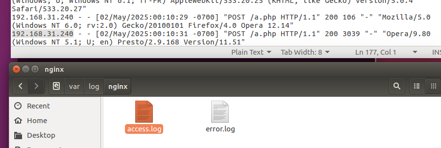

第二个 IP 与反弹 Shell 有关，在快照中正在运行的 Docker 容器中，因无法还原快照难以找到...于是另辟蹊径，用磁盘取证工具进行全盘搜索，还好找到了...具体分析过程见下文。

### Flag 收集

前两个 Flag 在 Windows 10 机器中（差点没找出来，好险），从任务计划中可以找到，分别是描述与操作对应的批处理文件中：

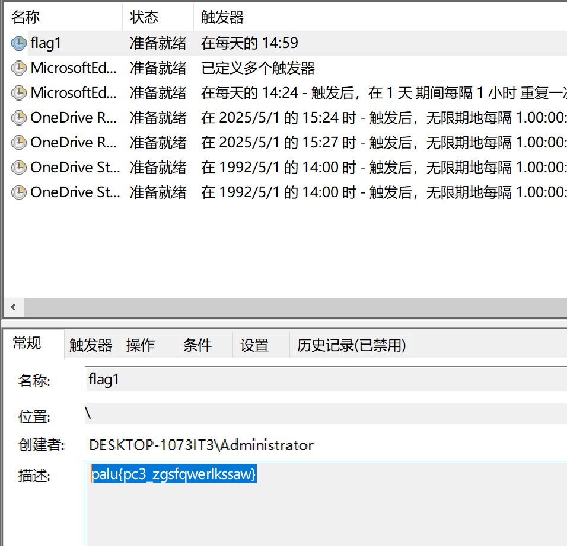

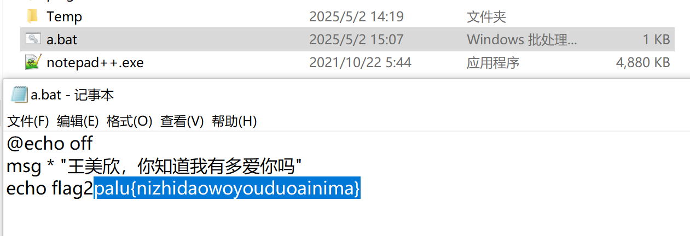

第三个 Flag 在数据库中，门槛低的方法是用 Webserver 提供的前端 (`index.php`) 访问。

!!! info "配置文件修改"

    视实际情况（比如丢弃了快照重新启动），SQL 机器的 IP 地址会有所不同，这里要在文件中做相应的修改。

...当然还是不可避免地看数据库...发现一个 ID 不太寻常，Flag 就在其中：

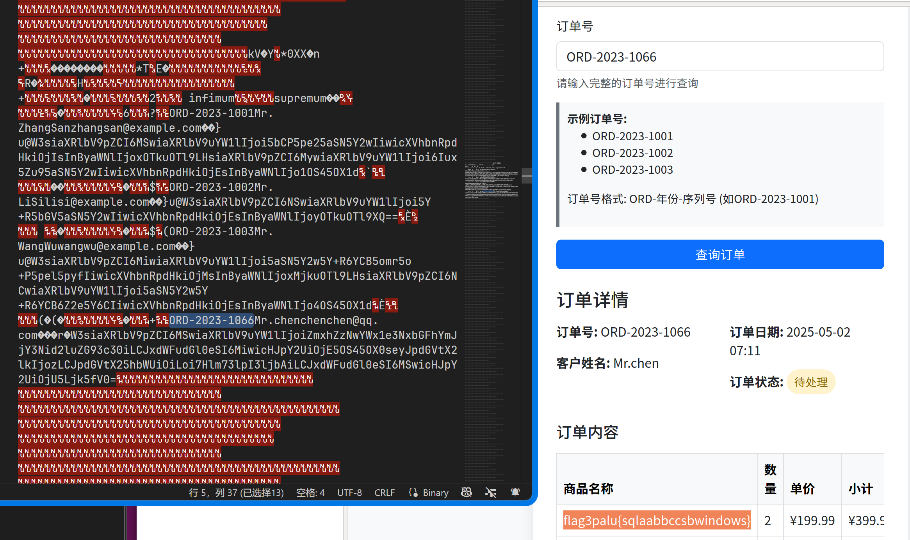

### Webshell 密码

没想到 IP2 与 Webshell1 两道题是放一起解的，也算是巧合吧：

- 最初查找 `.log`，可以找到 `clean-jpg.log` 这样一个不寻常的日志文件
- 转而查看同目录的 `clean.sh`，并在其中找到了反弹 Shell 行为与 IP 地址
- 顺水推舟在 `uploads` 中找到了 `shell.php`

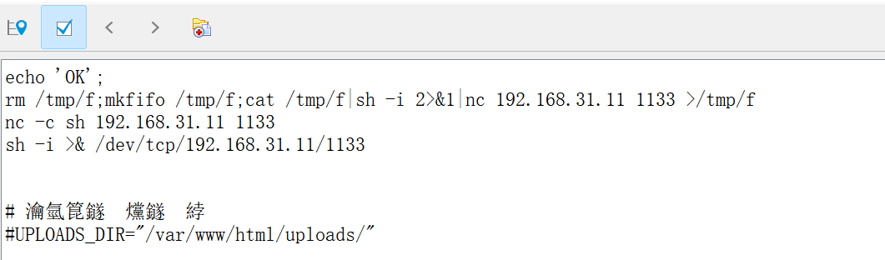

第二个密码比较好找，在 `/var/www/html` 下的 `a.php` 文件中。

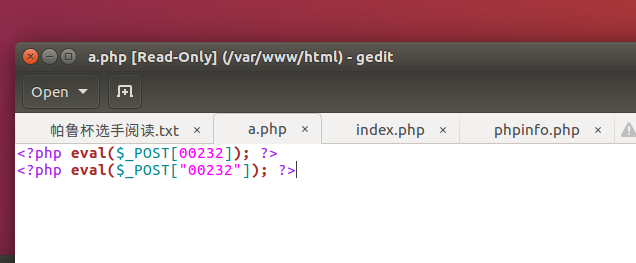

## 溯源

攻击者邮箱这道题有点无厘头，在参考别人的 Writeup 前从未想到与计算机用户名有关...

对 `简历.exe` 逆向分析查找字符串，调试文件引用信息暴露了用户名：

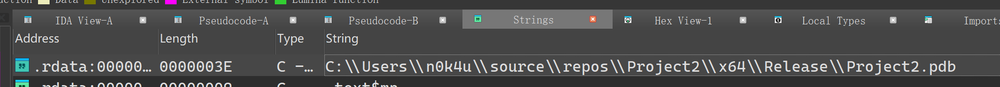

同样地，出于未知的原因在 GitHub 上查找该用户（可能是考虑到程序员在 Git 上最容易暴露邮箱？直接在网上搜也能轻易找到），发现用户并没有公开显示邮箱。于是使用 API 接口获取用户的最近活动，在提交记录中可以找到邮箱：

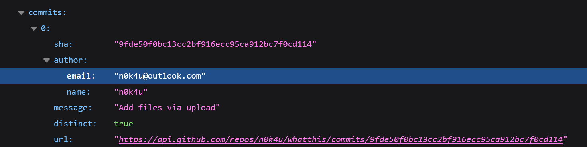

在该用户的[日记仓库](https://github.com/n0k4u/whatthis/blob/main/%E6%88%91%E7%9A%84%E6%97%A5%E8%AE%B0.txt)中找到了疑似 QQ 号的“密语”：

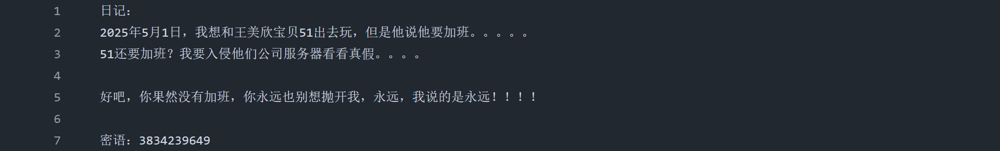

尝试在 QQ 上搜索并添加，Flag 出现在验证信息中：

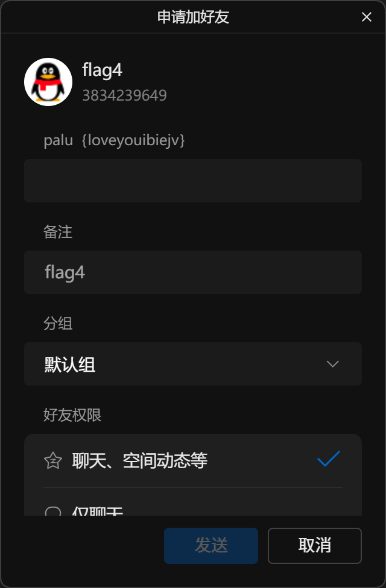

## 其他题目

钓鱼文件的哈希 32 位大写，考虑是 MD5。钓鱼文件在内网通的消息记录中：

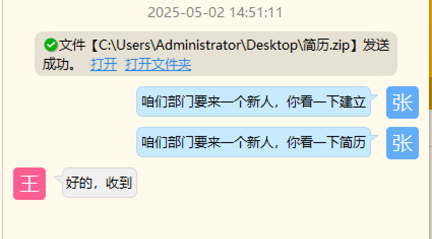

比赛期间没有理解隐藏账户的意思，后来在结合 `RidHelper.exe` 的逆向分析（是一个 RID 账户克隆的程序）时，怀疑与这个程序有关？

另外一点值得注意的是，Windows 10 机器上才能找到符合隐藏账户特征的 `system$` 账户，隐藏账户指的是这个？

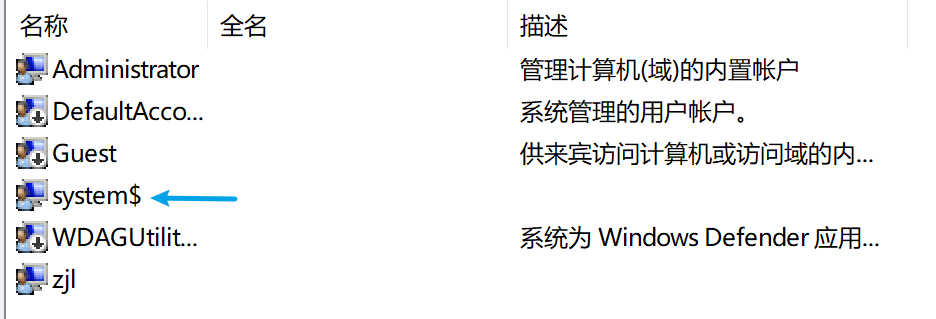
