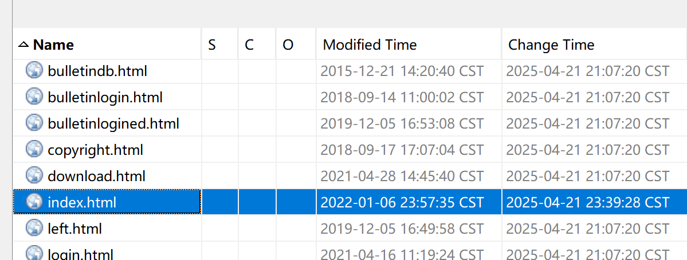
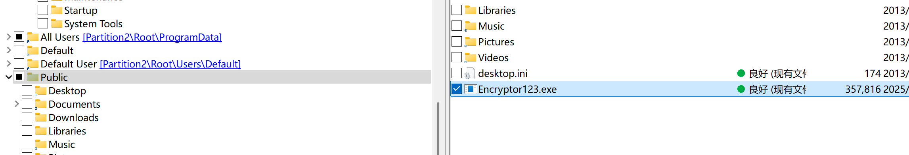

---
date:
  created: 2025-04-26
tags:
  - Solar
  - CTF
comments: true
---

# Solar 应急响应赛 4 月 Writeup

当月赛遇上周末调休...有点五味杂陈啊，不过比赛还是得打的嘛~

- 时间：4 月 26 日 10:00~18:00
- 附件大小：6 GB 压缩，解压后约 15 GB

!!! info "附件分类"

    - 可疑文件（逆向）：Windows x64 动态链接库
    - 应急行动（取证）：Windows Server 2012 R2 虚拟机

## 简单总结

相对上个月，这个月的题目多数相对简单，因此主要还是拼解出题数与速度。

做题的时候，希望你的脑子不会打结...如果一时不知道某个信息该从哪里入手去找，还是有点小痛苦的😅🖐️

这次的逆向题能做出来一大半了（或许多半是难度的原因），但是依然没做好最后处理，需要稍用点力。

## 解题过程

### 可疑文件

还在整理中...

### 应急行动-1

由题意提及服务器被侵入，则需要找到服务器的网络请求日志或流量信息。

经查，服务器上安装了 Rap Server，找到其日志文件 `RealFriend/Rap Server/Logs`，在其中发现了 PHP 任意命令执行的请求：

则答案为 `flag{192.168.56.128 21/04/2025}`。

### 应急行动-2

考虑到流量异常，则先在用户目录范围内寻找浏览器、网盘等类应用，先是在用户的下载目录找到了 `rclone`，是一个 Mega 网盘工具。

由此在用户目录寻找配置文件，可在 `AppData/Roaming/rclone` 下找到含有 Flag 的配置文件：

### 应急行动-3

在资源管理器中直接看到的修改时间是被篡改的，尝试后发现并不准确；转而使用 Autopsy 扫描文件系统，可得到正确的修改时间。

!!! tip "冷知识？"

    为何会出现 **Modified Time** 与 **Change Time** 这两个意义近似但完全独立的字段？它们的区别又在哪里？

    不同平台上的“修改时间”使用的都是什么时间？

    既然一个文件被修改过了，那它的修改时间为何如此奇怪？

此处答案为 `flag{2025-04-21 23:39:28}`。

### 应急行动-4

名义上说是第四题，其实是重量级的存在。不仅是因为1 Flag 有多个部分。

### 应急行动-5

通过搜索用户目录下的可执行文件，可以在公用用户根目录发现加密程序。

答案为 `flag{Encryptor123.exe}`。
