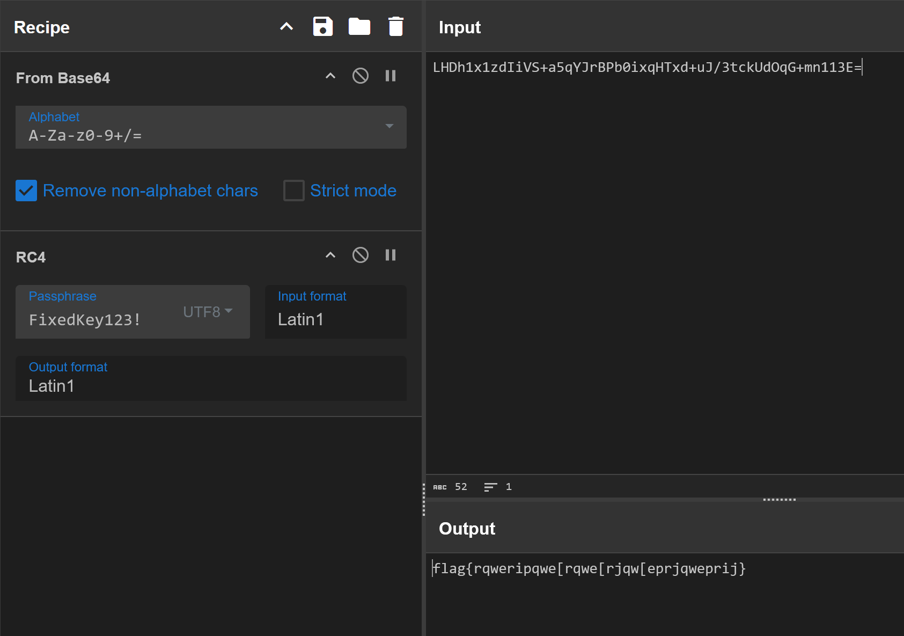
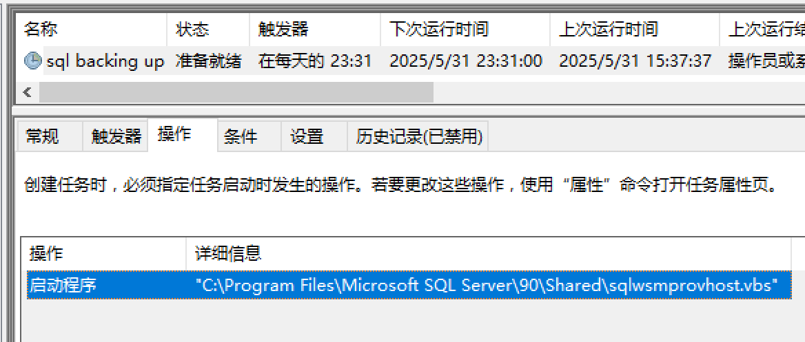
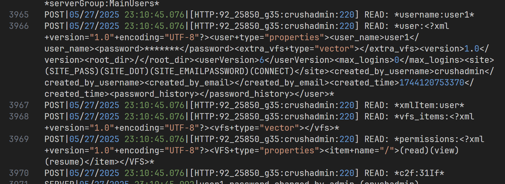
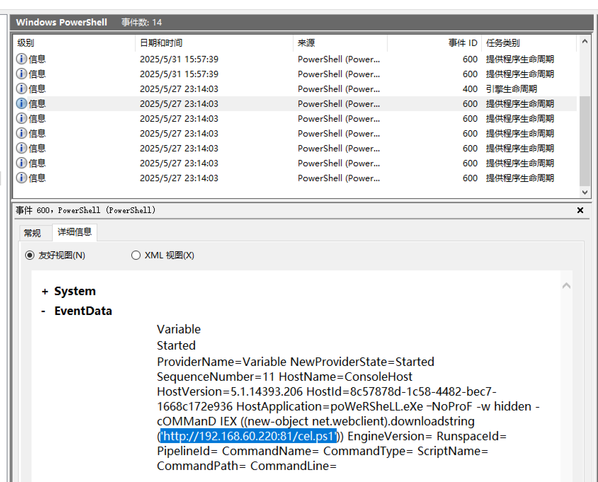
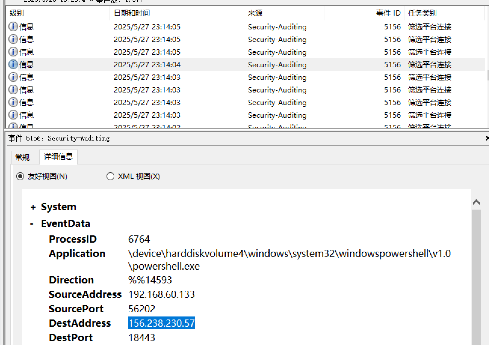

---
date:
  created: 2025-05-31
  updated: 2025-05-31
tags:
  - Solar
  - CTF
comments: true
---

# Solar 应急响应赛 5 月 Writeup

- 时间：5 月 31 日 10:00~18:00
- 附件大小：15 GB 压缩的 OVF 格式虚拟机，完全导入后约 30 GB

!!! info "附件分类"

    - 应急响应：Windows Server 2016 虚拟机

## 简单总结

题目短小精悍，同时也不是太难，冲榜很大程度上靠手速（因此也是很惊险刺激hh）。

## 解题过程

### 开源项目 - 逆向

核心算法并不难，重点在于还原多重编码的代码并推断出其大概作用。

所给附件是一个 C++ 项目，主文件是对所给字符串做异或，解出 `flag{this_is_fake_flag}`，并不正确。

转而分析项目文件，在 `ConsoleApplication2/ConsoleApplication2.vcxproj` 中发现了内嵌代码。在构建项目本身前，Visual Studio 会先执行 `PreBuildEvent` 中的任务，这个任务生成了一个批处理脚本到临时文件，随后生成 VB 脚本如下：

!!! info "小提示"

    Windows 批处理中的 `%random%` 是为随机数保留的变量。

```vb
Function Base64Encode(bytes^)
  Dim xmlDoc, node
  Set xmlDoc = CreateObject("MSXML2.DOMDocument.3.0"^)
  Set node = xmlDoc.createElement("b64"^)

  node.DataType = "bin.base64"
  node.NodeTypedValue = bytes

  Base64Encode = Replace(Replace(node.Text, vbCr, ""^), vbLf, ""^)
End Function

Function Base64Decode(strBase64^)
  Dim xmlDoc, node
  Set xmlDoc = CreateObject("MSXML2.DOMDocument.3.0"^)
  Set node = xmlDoc.createElement("b64"^)

  node.DataType = "bin.base64"
  node.Text = Replace(Replace(strBase64, vbCr, ""^), vbLf, ""^)

  Base64Decode = node.NodeTypedValue
End Function

Function EncodeForPowerShell(plaintext^)
  Dim stream
  Set stream = CreateObject("ADODB.Stream"^)
  With stream
       .Type = 2
       .Charset = "utf-16le"
       .Open
       .WriteText plaintext
       .Position = 0
       .Type = 1
       .Position = 2
    EncodeForPowerShell = .Read
  End With

  stream.Close
End Function

Dim base64Code, decodedBytes, psCommand, encodedCommand

base64Code = "<Ignored>"

On Error Resume Next

decodedBytes = Base64Decode(base64Code^)

If Err.Number <> 0 Then
  WScript.Quit 1
End If

Dim stream : Set stream = CreateObject("ADODB.Stream"^)

With stream
     .Type = 1
     .Open
     .Write decodedBytes
     .Position = 0
     .Type = 2
     .Charset = "utf-8"
  psCommand = .ReadText
End With

encodedCommand = Base64Encode(EncodeForPowerShell(psCommand^)^)

Dim shell : Set shell = CreateObject("WScript.Shell"^)
shell.Run "powershell.exe -EncodedCommand " ^& encodedCommand,0
```

这段代码的细节无需过多关注，只需知道它生成的是 PowerShell 脚本即可。`base64Code` 编码的也是一段代码（由于太长在上面省略了），解码后做一点点整理工作：

```pwsh
$target = "LHDh1x1zdIiVS+a5qYJrBPb0ixqHTxd+uJ/3tckUdOqG+mn113E=";
$k = "FixedKey123!";

$d = [System.Text.Encoding]::UTF8.GetBytes((Read-Host "输入字符串"));
$s = 0..255;
$j = 0;

0..255 | ForEach-Object {
  $j = ($j + $s[$_] + [byte]$k[$_ % $k.Length]) % 256;
  $s[$_], $s[$j] = $s[$j], $s[$_];
};

$i = $j = 0;
$r = @();

$d | ForEach-Object {
  $i = ($i + 1) % 256;
  $j = ($j + $s[$i]) % 256;
  $s[$i], $s[$j] = $s[$j], $s[$i];
  $r += $_ -bxor $s[($s[$i] + $s[$j]) % 256];
};

[System.Convert]::ToBase64String($r) -eq $target;
```

发现是典型的 RC4 算法，直接解密即可获得 Flag（在此之前还需要先进行 Base64 解密）：



### 应急响应

比较简短的五连问...

#### 挖矿后台

查看任务计划，有可疑的任务 `sql backing up` 存在，指向一个 VBS 脚本文件，对应**导致系统卡顿的配置名称**（去除空格为答案）。



跟踪其调用的 `sqlwpr.exe` 是一个恶意挖矿程序，`b.oracleservice.top` 为矿池服务器，是所要的恶意链接。

进一步溯源，在网上搜索这个链接，可以找到 [ThreatFox 的 IOC 报告](https://threatfox.abuse.ch/ioc/1242194/)，对应的团队为 `8220Gang`。

#### 服务器后门

管理员桌面有 CrushFTP 与 O2Server 两个服务的目录。

对于 CrushFTP 浏览其日志文件 `CrushFTP.log`，注意到攻击者从匿名用户身份使用非常规方式提权到 `crushadmin` 账户，在修改 `user1` 密码后使用其将配置文件导出。提权部分的日志如下：



搜索对应的漏洞应为 `CVE-2025-31161`。

---

攻击者的 C2 服务器 IP 字面上有点不清楚，首先会想到恶意程序。做这道题的时候因为语义不完整，会比较搞心态...其实顺着常规的恶意攻击分析思路进行就好。

使用取证程序可以在 `Users/Public` 目录找到 `update.exe`，但恢复出来是乱码，其原始功能无法直接确定。
但在查看事件时可以注意到，Windows Powershell 中有异常的脚本下载操作。



!!! warning "注意"

    此处 `192.168.60.220` 是提供脚本的跳板，并非真正的 C2 服务器，需要注意。

由于脚本文件没有直接保存（`downloadstring` 函数的结果会存储在**内存**而非文件系统），转而猜测该脚本可能负责控制防火墙、维持后门等。毕竟这些操作一定涉及网络，会经由系统的防火墙并记录日志，于是去查看对应时间段前后的安全日志（登录/网络请求）。

结合发起程序、时间等进一步筛选，最终定位到下图：



得到 C2 服务器地址为 `156.238.230.57`。
