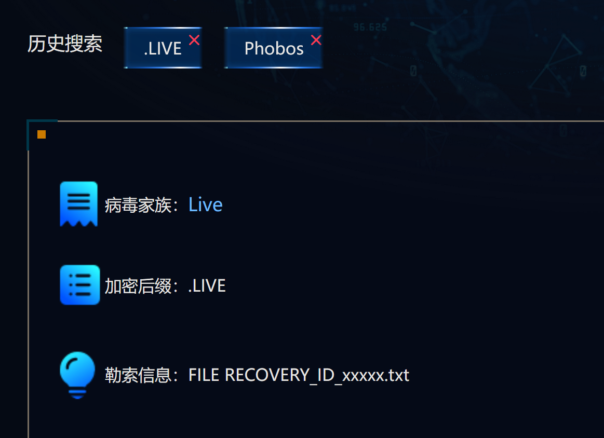
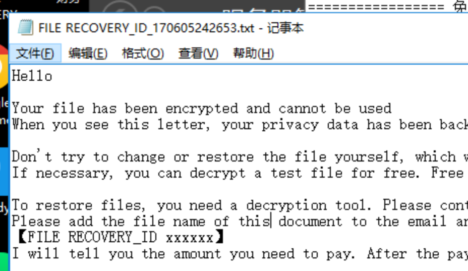
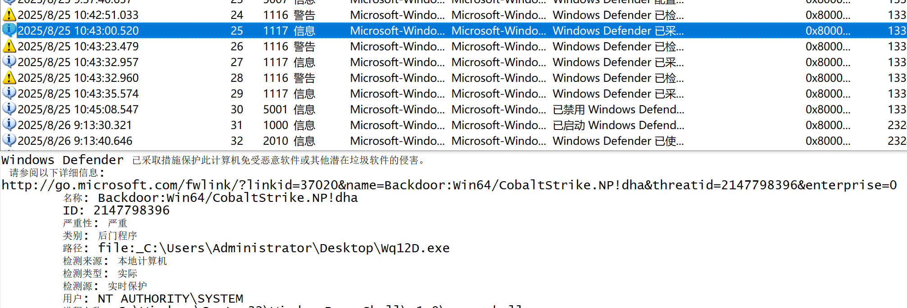
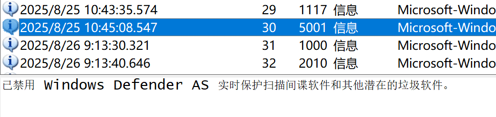
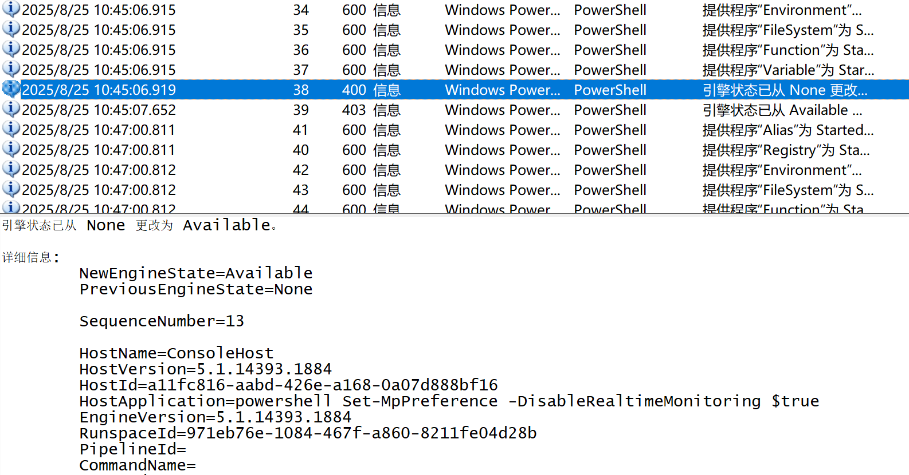
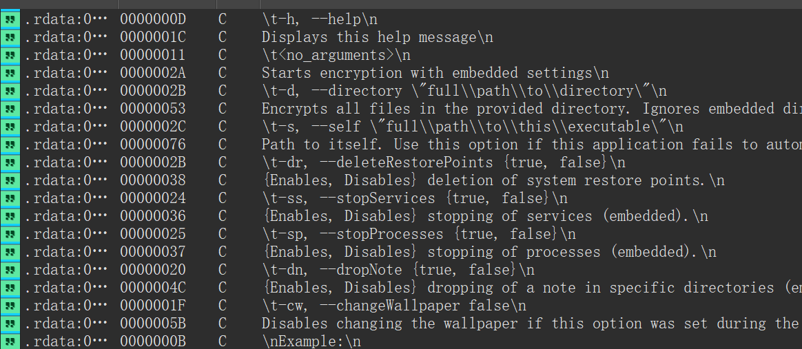

---
date:
  created: 2025-08-30
  updated: 2025-10-04
tags:
  - Solar
  - CTF
comments: true
---

# Solar 应急响应赛 8 月 Writeup

很不巧，这次比赛正好卡上开学返校的点，无论从做题还是 Writeup 来说都有些匆忙；基本所有题目都是在火车上做的你敢信？！

- 时间：8 月 30 日 10:00~18:00

!!! info "附件分类"

    - 应急响应：Windows Server 2016

## 应急响应

### 1 - 3. 病毒分析与文件恢复

简单分析环境，发现被加密的文件扩展名均为 `.LIVE`，由此在应急响应网站上搜索，得到病毒家族为 [`Live`](https://www.solarsecurity.cn/family?id=35)。

桌面上的 `FILE` 文件指示了预留 ID 的所在位置，由文件名可得 ID 为 `170605242653`。

之后需要寻找工具解密文件，通过在 solar 公众号获得 LIVE 病毒解密工具的下载链接（通过逐个尝试，得到版本为 LIVE 1.0），解密后的 Flag 内容为 `cf0971c1d17a03823c3db541ea3b4ec2`。

### 4 - 7. C2

在事件查看器中打开 Windows Defender 的日志并导出，可以发现如下隔离日志，则 Defender 删除 C2 的时间为 `2025.8.25_10:43`。

Windows Defender 被禁用的日志如下，得到其时间为 `2025.8.25_10:45`。

在用户的“下载”目录找到未知程序 `Wq12D.exe`，结合 Defender 日志与 Powershell 日志得出 C2 的绝对路径应为 `C:\Users\Administrator\Downloads\Wq12D.exe`。

将后门程序上传到沙箱进行分析，得到一个内网地址：

故考虑外连地址为 `192.168.186.2`。

### 8 - 9. 攻击路径溯源

在文档目录发现 `systime.exe`，提取并进行逆向分析后在字符串中发现可能是加密程序的特征：

故加密器路径为 `C:\Users\Administrator\Documents\systime.exe`。

溯源攻击路径时，发现 `E:\ruoyi` 下有部分未加密的 JAR 文件与日志文件，根据之前题目中的攻击时间找到对应的日志，有部分乱码，猜测被利用的漏洞位于 `E:\ruoyi\ruoyi-admin.jar`。
