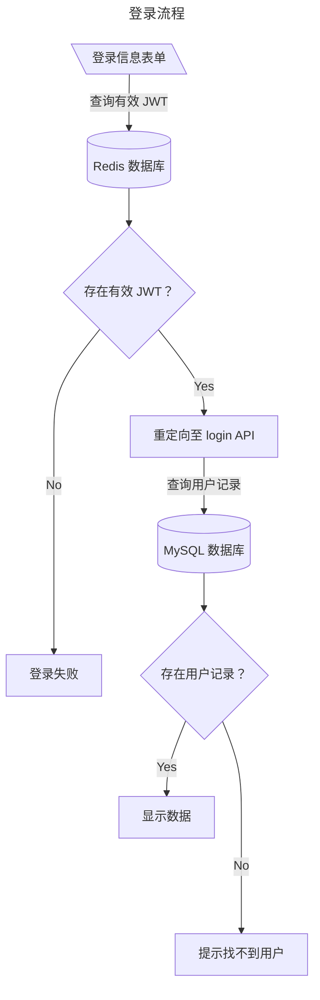
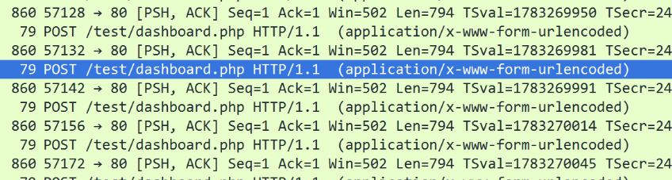
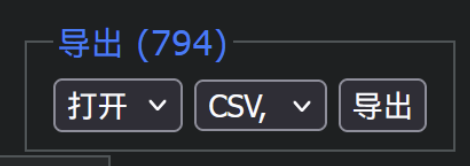
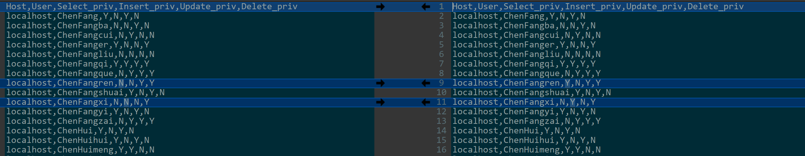
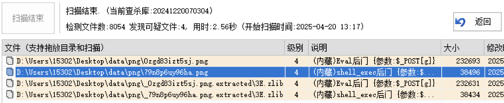

---
date:
  created: 2025-04-22
tags:
  - 数字中国
  - CTF
comments: true
---

# 数字中国 2025 线下决赛 Writeup

这次线下赛的题型比较集中创新，基本上就是在变相考察选手的数据分析与 Python 相关模块的利用能力。模块与模块间的题目都是连在一起的，整体形成一个模拟的系统环境，做起来比较舒服。

另外一部分是人工智能的模型安全题，很可惜因为涉猎甚少没能做出来。

本文剩余内容会涵盖笔者所有在赛场中解出（包括部分解出）的，以及复盘时有明确思路的题目。题目信息标号以所有题目标号为准。

## 数据安全综合场景赛

题目组成：

- 资产安全评估 x 2：Web 源代码审计 + 渗透测试
- 数据删除与恢复 x 3
- 数据识别与审计 x 4
- AI 模型安全 x 3
- 模型训练安全 x 2

### 数据删除与恢复

#### 3 - 登录令牌与数据库

!!! info "题目信息 - 3"

    管理员利用 AI 模型设计了一个结合 Redis 和 MySQL 的交易数据查询系统，但是未对代码的安全性进行充分验证，导致 MySQL 中的用户虽然被删除但仍可以利用 Redis 中的 JWT 信息，登录交易数据查询系统。请选手下载平台提供的附件（`用户表.xlsx`），根据用户表（其中 1 个用户为管理员测试账号，可进行数据库管理）及数据库中存在的用户,判断哪些用户在被删除后仍可以利用 JWT 进行登录，将用户名按照用户表中的先后排序，并使用“_”拼接后，通过 MD5 处理后进行提交。

用户表给出了九十余位用户的信息，

因为没想出合适的测试方法，表里的所有数据，是我们小队里的几个人一起分工分区试出来的，花了极其可观的时间...（不过现在想起来，可能就比写脚本加上测试的速度略慢一点点）

在逐个测试的过程中，发现下列用户在尝试登录时能够进入下一级页面，但是会报错“账户未找到”：

```csv
username,password
wangguizhi,cimer15&wangguizhi
ningxiurong,Mmningxiurong13%
zhanglihua,Nn14zhanglihua^
mengpeng,Llmengpeng12$cimer
gantingting,Kk11gantingting#
```

经过简单的分析，我们推测这是由服务器端使用了**双重验证**导致的：服务器在初步验证时会先从 Redis 中搜索是否存在对应的有效（在有效期内）JWT 信息；在验证成功后会将表单参数传至 `login` 接口，由此让 MySQL 数据库验证用户信息是否存在。这个过程的图示如下：



上面的用户登陆时跳转到了验证失败的页面，说明在 Redis 中有 JWT 信息，但 MySQL 中没有相应记录，因此符合要求；

用户可以正常登录：

```csv
username,password
wangyan,Ii9wangyan!
zhangxiuyun,Gg7&zhangxiuyun
huangzhiqiang,Ee5%huangzhiqiang
wanghua,wanghuaCc3cimer#
jinguizhi,jinguizhiJj10@
guoxiaohong,guoxiaohongDd4$
wangming,Hhwangming8*
chenxin,chenxinAa1!cimer
wuwen,cimer2@wuwen
```

这些用户的信息是正常存储在数据库中的，因此也能读取出对应信息。

管理员账户（同时也是后台数据库用户）：

```csv
username,password
zhangzehua,zhangzehua@cimer..
```

登录该账户后，会显示出额外的`进入管理员后台`按钮，这样我们可以从数据库中提取出后续题目所需数据。

!!! info "提示"

    数据库管理后台的登录用户与密码与上述相同。

拼接字符串得到：`wangguizhi_ningxiurong_zhanglihua_mengpeng_gantingting`

**答案：** ​`8429e825242b4e9063862b78da1e46dd`​

#### 4 - 借助双公钥恢复数据

!!! info "题目信息 - 4"

    当前交易数据查询平台的 MySQL 数据库中的 `order` 库，存放了备份加密订单交易数据及公钥信息，由于私钥丢失，公司订单数据无法恢复明文信息，现需利用公钥技术尝试恢复明文数据，确保业务运营的持续性。请选手将全部的加密数据进行明文恢复，并将订单号为 202502100811 的充值前米币数量和实付金额，通过 `_` 拼接后，作为标准答案提交。

#### 5 - 订单数据核对

!!! info "题目信息 - 5"

    在恢复订单数据后，发现部分订单存在账单异常问题。请选手根据恢复后的订单数据进行数据核查，找到充值米币到账数量错误的交易、米币优惠幅度高于 20% 的交易、VIP 到账天数错误的交易、实付金额错误的交易、VIP 充值优惠幅度高于 20% 的交易并统计每种错误交易类型的数量，请选手按照答案标准格式的排列顺序，通过 `_` 拼接后，作为标准答案提交。

    注意：

    - 充值会员 30 天为月卡，金额为 15 元.
    - 充值会员 90 天为季卡，金额为 30 元.
    - 充值会员 365 天为年卡，金额为 88 元.
    - 米币价格与充值金额，交易换算为 1:1
    - 计算充值优惠幅度是否高于 20% 时，使用正确的价格(充值金额或充值天数对应的金额)进行计算，不能使用现有错误实付金额计算

### 数据识别与审计

#### 6 - 越权请求识别

!!! info "题目信息 - 6"

    管理员进行 session 数据核验时，发现有些用户出现越权情况，正常情况下普通用户仅可查询自己 id 的内容，管理员用户可以查询任意 id 的内容。管理员将流量监控设备中生成的流量包和服务器生成的 session 文件，命名为 `yuequan.zip` 备份到了文件服务器中。请选手结合流量包和 session 文件识别出存在越权行为的用户 `login_id`，并按照数字大小顺序排列，通过 `_` 拼接后，作为标准答案提交。

根据附件中给出的越权判断标准，当非管理员用户请求搜索其他用户的信息时为越权。

比较简单的方式是，先在 WireShark 中筛选出符合要求的流量（此处是对 `/test/dashboard.php` ​的请求），将它们导出为单个流量包；



在此之后，使用`导出分组解析结果`​功能，导出流量的 JSON 序列化文件。

POST 表单中的 `search_id`​ 为用户请求的 ID 信息，而 session 信息在请求头的 `Cookie`​ 中（搜索等号即可），与附件中的一批 session 文件是对应的。对于每个 session 文件，可以手动找出 `login_id`​ 与 `is_admin` ​所在的位置，读取并转化为我们需要的形式。

由此得出的脚本如下：

```python
import json

data: list = []

def check_priv(cookie: str, search_id: str) -> bool:
    with open(f"list/session_{cookie}", "r", encoding="utf-8") as s:
        sc = s.read()
        id_index = sc.find("login_id") + 8 + 4
        id_stop = id_index
        login_id = ""

        while id_stop <= len(sc) - 1:
            if sc[id_stop].isdigit():
                login_id += sc[id_stop]
                id_stop += 1
            else:
                break

        admin_index = sc.find("is_admin") + 8 + 4
        is_admin = sc[admin_index] == "1"

        if (not is_admin) and search_id != login_id:
            print(login_id)
            return False
        else:
            return True

        # print(f"{sc[id_index]} {sc[admin_index]}")

with open("1212.json", "r", encoding="utf-8") as f:
    fc = f.read()
    data = json.loads(fc)
    for entry in data:
        try:
            http_data = entry["_source"]["layers"]["http"]
            value = entry["_source"]["layers"]["urlencoded-form"]
            cookie = http_data["http.cookie"]
            session_index = cookie.find("=") + 1

            dp = json.dumps(value)
            v_index = dp.find("value") + 9
            # search_id
            # print(dp[v_index:-3])

            check_priv(cookie[session_index:], dp[v_index:-3])
        except KeyError:
            continue
        #except Exception as e:
        #    print(e)
        #    continue
```

**答案：** ​`607_715_867_1133`​

#### 7 - 权限差异比较

!!! info "题目信息 - 7"

    交易数据查询系统的数据库 `adminers` 库中存放了平台部分用户权限的备份数据。为了确保数据库的安全性和合规性，公司需要每月对数据库用户权限进行审计。请选手下载平台提供的附件，分析 `用户权限表.pdf` 文件，找出数据库中权限分配不一致的用户。请选手进行数据对比，找到被删除的用户，被添加的用户，权限发生更改的用户进行分别统计，通过 `_` 拼接后，作为标准答案提交。

这题的主要难点在于，如何从数据源中提取数据，同时还要保证二者形式上的差距不太大（这样比较起来才更简单）。

- 在管理系统中，将`adminers`​表内容导出为 CSV 格式；

  

- 使用工具从 PDF 中提取所有文本，手动将其逗号分隔；

注意，提取出的内容转化为 CSV 后，需要**再次按用户值**排序，否则比较的结果可能会有出入（尤其是直接使用差异工具对比时）。

处理完成后，使用差异可视化工具直接进行对比。接下来，数就完了！



CSV 文件层面的差异可视化比较简单直观，属于可以肉眼看出来的程度。如果数据量大一点，则需要考虑使用 Python 的相关数据分析模块与特性来协助处理一下。

**答案：** ​`9_3_9`​

#### 8 - 爬虫范围分析

!!! info "题目信息 - 8"

    为方便商家和顾客及时了解商品销售趋势与用户测评数据，公司提供了一个商品测评汇总平台，平台上有各种热门商品及测评报告 URL 链接。请选手提取**热门商品**中的所有的测评报告 URL 链接，请选手下载平台提供的附件，分析附件中的 `robots.txt` 的规则进行数据处理操作。选手需要确定哪些链接是可以进行爬虫的，哪些是不可以进行爬虫的，统计出不可以爬虫的URL的数量并作为答案进行提交。

    注：`robots.txt` 中，`Allow` 优先级要高于 `Disallow`。

题目中给出的 `robots.txt` 附件内容如下：

```robots
User-agent: *
Allow: /download
Allow: /about
Allow: /services
Allow: /title
Allow: /products
Allow: /api/v2/safe
Allow: /register
Allow: /temp
Allow: /logs/public
Allow: /system
Allow: /search?q=
Allow: /*.zip$
Allow: /restricted
Allow: /cart

Disallow: /logs
Disallow: /user/profile
Disallow: /api
Disallow: /admin
Disallow: /private/folder
Disallow: /debug
Disallow: /details
Disallow: /*.bak$
Disallow: /*?token=
```

我们尝试直接从网站上复制文本，发现格式很规整，链接总以**纯文本**的形式，在**单独一行**内呈现，适合进行处理：

```md
商品测评汇总平台

追风筝的人
图书
https://trustedreviews.org/debug

美的智能门锁
家电
https://producthub.com/private/folder
...
```

将网站的所有 30 页中的文本输出到单个文件上，然后使用 Python 的正则表达式匹配功能进行处理与统计：

```python
import re

total = 0
banned = 0

ALLOW_LIST = [
    re.compile(r".*/download"),
    re.compile(r".*/about"),
    re.compile(r".*/services"),
    re.compile(r".*/title"),
    re.compile(r".*/products"),
    re.compile(r".*/api/v2/safe"),
    re.compile(r".*/register"),
    re.compile(r".*/temp"),
    re.compile(r".*/logs/public"),
    re.compile(r".*/system"),
    re.compile(r".*/search\?q="),
    re.compile(r".*/*.zip$"),
    re.compile(r".*/restricted"),
    re.compile(r".*/cart")
]

BAN_LIST = [
    re.compile(r".*/logs"),
    re.compile(r".*/user/profile"),
    re.compile(r".*/api"),
    re.compile(r".*/admin"),
    re.compile(r".*/private/folder"),
    re.compile(r".*/debug"),
    re.compile(r".*/details"),
    re.compile(r".*/*.bak$"),
    re.compile(r".*/*\?token="),
]

def not_allowed(url: str) -> bool:
    for r in ALLOW_LIST:
        if r.match(url):
            return False

    for r in BAN_LIST:
        if r.match(url):
            return True

    return False

with open("http.txt", "r", encoding="utf-8") as f:
    while True:
        line = f.readline()
        if line == "":
            break

        if line.lower().startswith("http"):
            total += 1
            banned += 1 if not_allowed(line) else 0

    print(f"[i] {banned} of {total} links disallowed.")
    f.close()

# Output:
# [i] 503 of 1496 links disallowed.
```

**答案：** `503`

#### 9 - 异常数据识别

!!! info "题目信息 - 9"

    公司管理员在商品测评汇总平台中的文件服务器，存放了一些商品相关或者用户上传的文件数据，包括 TXT，图片，PDF，音频数据。在各种数据中，可能泄露了一些敏感信息或者某些用户插入了恶意代码到各种类型数据中。请选手对于各种数据类型的文件进行审计，找到带有敏感信息或者恶意代码的数据文件，并将文件名列出来。每提交一个正确的文件名可得 `(题目总分数/标准答案个数)` 分，每提交一个错误的文件名扣 `(题目总分数/标准答案个数)` 分，扣到 0 分为止。请选手尽可能的提交正确答案。

    注：请选手将所有正确的答案汇总到一个 txt 文件中，并通过 SSH 访问文件服务器对应地址的 2222 端口（账号/密码：`lowuser/lowuser`），将答案文件放到 `/home/lowuser/` 目录下。请选手下载平台提供的附件，参照附件中的 `data.pdf` 要求的答案格式进行提交,否则会影响成绩。

总体看下来，TXT 文本文件是最好分析的，可以结合关键词与字符过滤的方式找出敏感信息文件：

```python
import re
import os

# 这里用到了一些常用的敏感数据关键词
WORDS = [
    "手机号",
    "号码",
    "身份",
    "邮箱",
    "银行",
    "卡",
    "联系",
    "泄露",
    "信息",
    "地址",
    "姓名",
    "名字",
    "车",
]

# 严判：使用正则表达式滤出所有英文字母与数字
SENSITIVE_TAGS = [
    re.compile(r".*[A-Z]+"),
    re.compile(r".*[a-z]+"),
    re.compile(r".*[1-9]+"),
]

def has_sensitive(src: str) -> bool:
    # 为什么不用 isalnum() 判别 ASCII 与数字？见下文
    # for s in src:
    #     if s.isalnum():
    #         return True

    for r in SENSITIVE_TAGS:
        if r.match(src):
            return True

    for w in WORDS:
        if src.find(w) != -1:
            return True
        else:
            return False

for root, dirs, files in os.walk("./txt"):
    for file in files:
        with open(f"./txt/{file}", "r", encoding="utf-8") as f:
            line = f.read()
            if has_sensitive(line):
                print(file)
                print(line)

# Output（已脱敏）:
# 24HZjcP.txt
# 这个商城平台竟然将我的手机号153********，泄露给了商家！
# 6L30ItW.txt
# 我的家庭地址是，南京**********，你发的地址对吗？
# A4qDo79.txt
# 我的地址是北京市**********，客服竟然写成了西安市。
# QE7wx1n.txt
# 客服竟然知道了我的身份证号231221************。
# R4TlSMS.txt
# 请将发票，发送到我的邮箱，********@gmail.com。
# teM7IdO.txt
# 请售后尽快联系我，187********，不然我投诉你们！
# VMf5L4x.txt
# 请售后与我联系，132********。
```

对于 PNG 文件，使用 D 盾扫描在 PNG 文件中发现后门：



!!! info "复现说明"

    另外两种文件的判别方式，作者在实际比赛时没有想出，赛后复盘时根据他人的经验与自己的理解补充在此。
