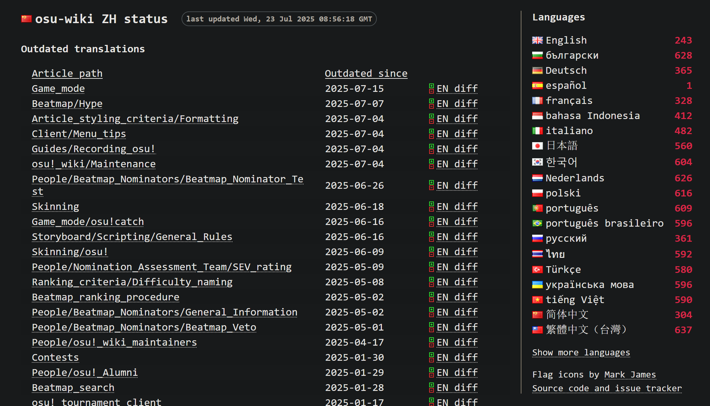
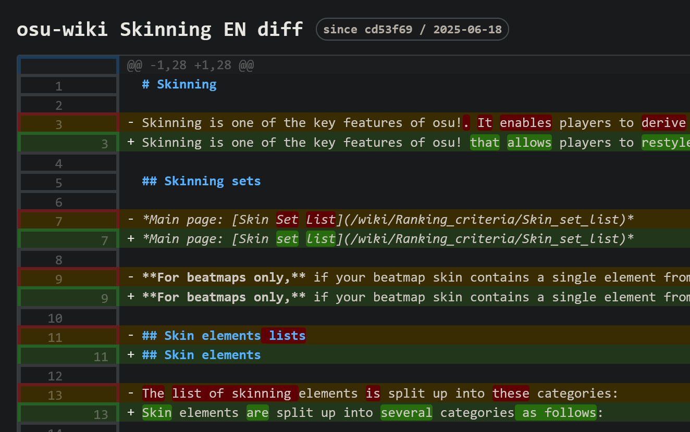

---
tags:
  - translation
  - osu!
  - osu!wiki
  - contribution
  - guide
  - WIP
comments: true
---

# osu!wiki 翻译指南

这篇文章作为 [osu!wiki 贡献指南](https://osu.ppy.sh/wiki/zh/osu%21_wiki/Contribution_guide)的补充与延伸，旨在向有志于参与 osu!wiki 中文翻译的人简单介绍一下贡献流程，以及在此过程中，一些可以用到的工具与资源。与此同时，提出一些发展性的建议，让 osu!wiki 的原文及翻译更能被理解，简明易懂，受欢迎。

## 1. 寻找目标

绝大多数贡献者（包括我）通常是在官网阅读 wiki 时遇到翻译过期或缺少翻译的提示时，突然就萌生出了想要自己翻译对应文章的冲动... 这确实是很正常的现象。

概括起来，osu!wiki 的翻译工作归为以下两类：

- 新翻译：从头开始翻译一篇文章
- 修订翻译：依照原文更新文章翻译，或者改善现有翻译

不过，如果你想要了解整个 wiki 的翻译情况，[cl8n 的小网站](https://osu.wiki/status/zh "osu!wiki 状态跟踪（简体中文翻译）")应该能派上用场。具体用法[请见下文](#tracker-usage)。

## 2. 翻译与自查

决定好要做的事情后，就可以开始翻译了。

### 内容格式

osu!wiki 中的规范很多，但翻译时并不要求全都记住。

在翻译的过程中，记住这几点会有助于保持不同文章翻译间排版与格式的统一性：

- 确保新文件的编码为 UTF-8，行尾序列设置为 LF
- 标题前后、段落之间都需要加空行，列表内项目间不加空行
- 中英文、中文与数字间需要加一个（半角）空格以使排版美观，某些特殊情况除外
- 位于行首与列表项开头的粗体/斜体样式后需要加一个空格，以使其能正常渲染
- 括号（通常是小括号）的样式取决于其中的内容，其他标点的应用以中文为主，灵活运用
- 标题若有自定义标签，需保留不译以保证不同语言都能使用同一标签定位到相同的小节
- 头注中的标签尽量翻译，翻译内容附加到所有原有标签后
- 一般不将术语的中英文同时给出，全文第一次提及而且并非常用的除外
- 代码块中的按键、变量、方法名等应保留原文

上述规则的运用可参考下列示例（选自 AR 值文章的中文翻译，经过轻度改写）：

```md
---
tags:
  - approach time
  - AR
  - reading
  - 读谱
  - 缩圈时间
---

# 缩圈速度 (Approach rate)

*关于建议的 AR 值，参见：[谱面上架标准 (RC)](/wiki/Ranking_criteria)。*

**缩圈速度** (***AR***) 是一张[谱面](/wiki/Beatmap)的难度设置，定义了[打击物件](/wiki/Gameplay/Hit_object)相对于应被打击或收集时开始渐显的时间。

<!-- 括号样式取决于内容：全英文则使用英文样式，有中文则使用中文样式 -->
在 [osu!taiko](/wiki/Game_mode/osu!taiko) 与 [osu!mania](/wiki/Game_mode/osu!mania) 模式中，AR 值设置不起作用。

两个模式中的滚动速度由[滑条速度 (slider velocity)](/wiki/Gameplay/Hit_object/Slider/Slider_velocity)决定，其依赖于 [BPM](/wiki/Music_theory/Tempo) 与滑条速度乘数。

## 动画时长<!-- 大括号部分为自定义标签 --> {#animation-length}

打击物件在屏幕上保持可见的时长范围为从 AR0 的 1800 毫秒到 AR10 的 450 毫秒。

...

打击物件在 `X - preempt` 时刻开始渐显，其中：

<!-- 代码块：保留变量与方法名 -->
- AR < 5: `preempt = 1200ms + 600ms * (5 - AR) / 5`
- AR = 5: `preempt = clamp(AR * 1.14, 514, 1919)`
- AR > 5: `preempt = 1200ms - 750ms * (AR - 5) / 5`

### 表格比较


HT 或 DT 下的 AR 值通常指其感知值。比如，“AR 8 + DT”也可以写作“AR 9.6”。
```

## 3. 提交更改

osu!wiki 的文章作为 Markdown 格式文件源代码被 Git 统一管理。在使用它提交翻译时，也应遵循相关的开发流程与实践规范。

### Git 提交 (Commit)

提交信息力求简洁凝练，能反映提交中的**更改内容**。目前常用的格式是 `[语言代码] Add/Update/Clean up <文章英文名>`，这样能清楚地看出分支做出的更改，从而有助于在创建 PR 时写一个明确清晰的标题与描述。

- **不好**：Update zh.md
- **好**：[ZH] Add `Client`
- **不好**：Add translation of `Client` articles and fix typo in `Client/Release_stream`

此外，在采纳审阅建议的提交中可以花点小心思写一下提交信息，这样未来你与其他审阅者在看更改的时候会更清楚别人审阅的内容。直接使用默认信息（GitHub 网页端）也可以，不过太多了会显得不太好看。

- **还行**：Apply suggestion from code review
- **不错**：Rewrite translation in feature comparison

如果对已经提交的内容还要做更改（比如发现了错别字，或者想改一下提交信息），可以使用 Git 的**修正 (Amend)** 功能更新上一次提交，无需再添加新提交。

在为你的分支创建分支后，如果你对 Git 中的合并与变基操作不太明白，还是尽量不要尝试在分支中这么做（搞不好会让提交记录乱糟糟的）。当然，在翻译前从上游更新最新内容是完全可以的，直接合并即可。

### GitHub 拉取请求 (PR)

osu!wiki 仓库有针对拉取请求（下面统称 **PR**）的默认模板。在你创建 PR 时，应该可以看到描述框中填入了这样的东西：

```md
<!--
  - Use [x] to complete the items
  - Remove the items unrelated to your work
  - Add any relevant information you consider useful
  - If there are no reviewers for your language, please mention it explicitly
-->

## Self-check

- [ ] The changes are tested against the [contribution checklist](https://osu.ppy.sh/wiki/osu!_wiki/Contribution_guide#self-check)
- [ ] *(translations only)* The changes are reviewed on GitHub [by a fluent speaker](https://osu.ppy.sh/wiki/osu!_wiki/Contribution_guide#review)
```

这里的 Self check 对应着 osu!wiki 贡献过程中的两个步骤：**自查**与**审阅**。一般情况下第一项熟悉的话可以直接打勾，第二项需要等到有人审阅之后再去勾选。

在网页端创建 PR 时，页脚会有一个 `Allow edits and access to secrets by maintainers` 的复选框需要勾选，这样维护者能够向你的分支推送更改（比如在最终合并前更新分支）。

我们一般鼓励你将已经完成的翻译创建 PR，不过如果要翻译的内容过多，而你觉得一时半会做不完，可以先将部分翻译提交并推送，在创建 PR 时选择 `Create draft pull request （创建草稿拉取请求）`，等翻译完成后再转换成正常状态。

## 4. 审阅与合并

翻译审阅是 osu!wiki 翻译中的另一重要环节，与自动化的持续集成 (CI) 检测配合使用。具体来说，CI 能保证提交的文件没有格式、Markdown 语法规范上的问题，而人工审阅能使翻译合乎语义、通顺流畅，质量基本过关。

在 GitHub 上提交翻译 PR 后，你需要等待其他人的审阅。

## 附录

这一小节收纳了一些常用工具与资源，部分内容基于个人经验给出。

### 本地开发环境 {#dev-env}

如果你打算在本地编辑 osu!wiki 的内容，需要以下工具：

- 文本编辑器（支持 Markdown 与 EditorConfig 者较好）
- Git：用于版本控制、拉取与提交更改

笔者常用的是 [VS Code](https://code.visualstudio.com) / Code OSS 与 [Kate](https://apps.kde.org/zh-cn/kate)。后者自带 Markdown 的格式支持，前者可以通过安装插件来实现；

- markdownlint
- EditorConfig for VS Code

### osu!wiki 规范 {#official-criteria}

目前 osu!wiki 中存在已经很完备的规范性文章，同时也有为贡献者准备的贡献指南。

- [贡献指南](https://osu.ppy.sh/wiki/zh/osu!_wiki/Contribution_guide)：集中于讲述一篇文章（翻译）从编辑到呈现的全过程，建议新人先去通读
- [文章风格规范](https://osu.ppy.sh/wiki/zh/Article_styling_criteria)：分为[排版](https://osu.ppy.sh/wiki/zh/Article_styling_criteria/Formatting)与[写作](https://osu.ppy.sh/wiki/zh/Article_styling_criteria/Writing)两部分，是 osu!wiki 的强制执行样式标准

如果在实际翻译时依然不熟悉具体的规则，可以参照英文原文的排版进行翻译。

### 术语表与参考 {#terms-reference}

[osu!ATRI](https://github.com/osu-atri) 中译组织在其网站上维护着一份简单的分类术语表，可以在 [GitHub Pages](https://osu-atri.github.io/osu-dictionary) 访问。

### 使用 wiki 状态跟踪网站 {#tracker-usage}

为了让 wiki 翻译者之间能协调翻译工作，[clayton (cl8n)](https://github.com/cl8n) 写了这样一个跟踪网站，通过拉取 osu-wiki 仓库源代码并进行解析，获取各个文章的翻译与更新状态。项目源码可在 [GitHub](https://github.com/cl8n/osu-wiki-status) 上查看。

打开主页面后显示的信息如下：



页面右侧显示 osu!wiki 支持的所有语言，红色数字为对应语言需要处理的文章数目，点击可切换到不同语言的跟踪页面。

页面左侧（主体）会列出所有需要处理的文章与分类，这些状态往往由 wiki 维护者作为标签添加到源文件，跟踪工具解析后显示：

- Outdated translations：翻译过期，需要依照原文更新。
- Missing articles / stubs：文章缺少翻译。
- Needs cleanup：因内容或结构上的问题而需要重写/重译。
- No native review：没有其他人审阅，通常是因为 PR 长时间没人审阅。

除此之外，如果英文原文有特殊状态（如过时），则会另立分类列出。点击文件名会跳转到 GitHub 仓库的对应文件页面。

对于过期翻译，页面会列出它们的过期时间（被标记为过期的时间），同时给出差异 (`EN diff`)。



差异预览页面会简单显示出最新版本文件相对于前一版本的更改，在自检或者为他人审阅时都能使用，可以有效找出漏译错译的内容。当然如果有条件，可以使用其他更加强大或顺手的历史差异比较工具...
